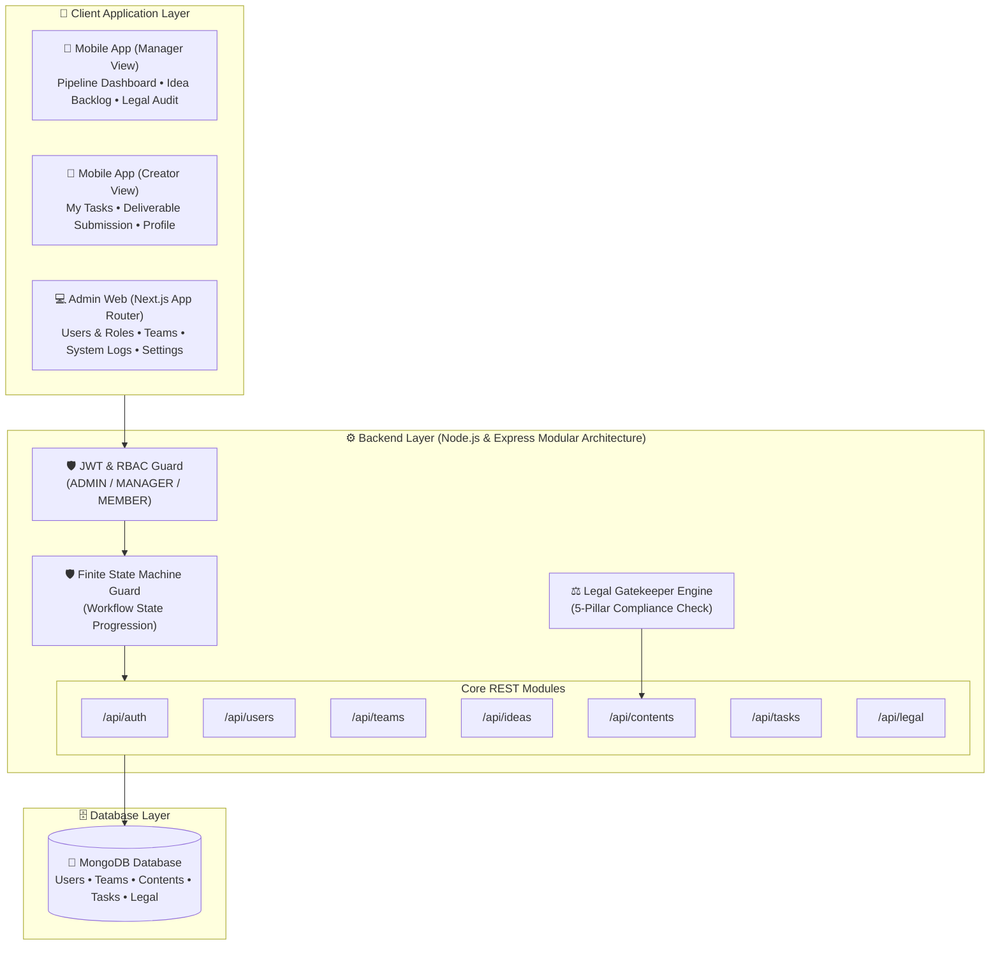

<div align="center">

# 🎬 Content Production Management System (CMS)
### Enterprise Media Lifecycle Architecture • Finite State Machine • Legal Compliance Gatekeeper

[](https://nodejs.org)
[](https://expressjs.com)
[](https://reactnative.dev)
[](https://nextjs.org)
[](https://www.mongodb.com)
[](LICENSE)

<p align="center">
  ระบบบริหารจัดการกระบวนการผลิตสื่อครบวงจรระดับองค์กร (End-to-End Media Pipeline) ออกแบบตามหลักวิศวกรรมซอฟต์แวร์จริง<br>
  ควบคุมสายการผลิตด้วย Finite State Machine, ระบบตรวจสอบสิทธิ์ทางกฎหมาย 5 เสาหลัก และชุดเอกสารวิชาการ 7 รายการตามมาตรฐานสากล
</p>

[📌 วงจรการผลิต](#-วงจรการผลิตสื่อ-production-lifecycle) •
[🏛️ สถาปัตยกรรมระบบ](#️-สถาปัตยกรรมระบบ-system-architecture) •
[👥 สิทธิ์ผู้ใช้ (RBAC)](#-บทบาทและสิทธิ์ผู้ใช้งาน-rbac) •
[📚 7 เอกสารวิชาการ](#-ชุดเอกสารวิชาการ-7-รายการ-academic-deliverables) •
[⚡ วิธีการติดตั้งและรัน](#-วิธีการติดตั้งและเริ่มต้นใช้งาน-quickstart) •
[🚀 แผนงานต่อยอดปี 4](#-แผนงานต่อยอดปี-4-future-capstone-roadmap)

---

</div>

## 📌 วงจรการผลิตสื่อ (Production Lifecycle)

ระบบถูกออกแบบมาเพื่อควบคุมกระบวนการผลิตสื่อตั้งแต่ต้นจนจบ โดยเปลี่ยนการทำงานที่กระจัดกระจาย สู่ **สายการผลิตที่เป็นระบบ (Finite State Machine)**:

$$\text{Idea} \rightarrow \text{Planning} \rightarrow \text{Task Assignment} \rightarrow \text{Production} \rightarrow \text{Legal Check} \rightarrow \text{Review} \rightarrow \text{Revision} \circlearrowleft \rightarrow \text{Approval} \rightarrow \text{Schedule} \rightarrow \text{Publish}$$

### 🌟 ฟังก์ชันหลักที่ทำงานได้จริง 100% (Core System Features)
1. **🛡️ Finite State Machine (FSM) Guard**: ตรวจสอบการเปลี่ยนสถานะที่ Backend ป้องกันการข้ามขั้นตอนโดยพลการ (บล็อกไม่ให้ข้ามจาก `PLANNING` ตรงไป `PUBLISHED`)
2. **⚖️ 5-Pillar Legal & Compliance Gatekeeper**: ด่านตรวจสิทธิ์ทางกฎหมาย 5 ประการก่อนเผยแพร่สื่อ (ลิขสิทธิ์เพลง, ลิขสิทธิ์ฟุตเทจ, PDPA ยินยอมใบหน้า, เครื่องหมายการค้าสปอนเซอร์, และนโยบายชุมชน) **ระบบบล็อกการอนุมัติและเผยแพร่เด็ดขาดหากไม่ผ่านครบ 5/5 ข้อ**
3. **🔄 Review & Revision Loop**: เมื่อ Creator แนบลิงก์ผลงาน (Drive / Frame.io) ส่งตรวจ ระบบจะขยับเข้าคิวตรวจของ Manager โดยอัตโนมัติ พร้อมรองรับการสั่งแก้ไขงาน (Revision Notes) และบันทึกประวัติการสั่งแก้
4. **📱 Multi-Platform Client Ecosystem**:
   - **Admin Web (Next.js)**: จัดการผู้ใช้งาน, จัดการทีม, กำหนดประเภทงาน, บริหารข้อกฎหมาย, และตรวจสอบ System Audit Logs
   - **Mobile App (React Native)**: เมนู Bottom Tab Bar รองรับทั้งมุมมอง **Manager Dashboard** (คิวงานและอนุมัติ) และ **Creator Workbench** (รับงานและส่งมอบผลงาน)

---

## 🏛️ สถาปัตยกรรมระบบ (System Architecture)

สถาปัตยกรรมของระบบปัจจุบันที่ทำงานร่วมกันแบบ Real-time:



---

## 👥 บทบาทและสิทธิ์ผู้ใช้งาน (RBAC)

| ฟังก์ชันการทำงาน (Capabilities) | 👤 Admin (Web) | 👔 Manager (Mobile) | 🎨 Member (Mobile) |
| :--- | :---: | :---: | :---: |
| **เข้าสู่ระบบ (Authentication)** | ✅ | ✅ | ✅ |
| **จัดการผู้ใช้งานและสลับ Role (Users Management)** | ✅ | ❌ | ❌ |
| **จัดการโครงสร้างทีม (Team Management)** | ✅ | ✅ | ❌ |
| **เสนอและโหวตไอเดีย (Propose Ideas)** | ✅ | ✅ | ✅ |
| **อนุมัติไอเดียเข้าสู่สายการผลิต (Approve Ideas)** | ✅ | ✅ | ❌ |
| **สร้าง Content และมอบหมาย Task ย่อย** | ✅ | ✅ | ❌ |
| **รับงานและแนบลิงก์ส่งงาน (Submit Deliverable)** | ❌ | ❌ | ✅ |
| **ตรวจงานและสั่งแก้ไข (Review & Request Revision)** | ❌ | ✅ | ❌ |
| **ตรวจสิทธิ์กฎหมาย 5 ข้อ (Audit Legal Checklist)** | ❌ | ✅ | ❌ |
| **อนุมัติขั้นสุดท้ายและเผยแพร่ (Approve & Publish)** | ❌ | ✅ | ❌ |
| **ตรวจสอบ Audit Trail และ System Monitor** | ✅ | ❌ | ❌ |

---

## 📚 ชุดเอกสารวิชาการ 7 รายการ (Academic Deliverables)

เอกสารการวิเคราะห์และออกแบบระบบตามข้อกำหนดของรายวิชา (Software Engineering & Senior Capstone Rubric):

| ลำดับ | รายการเอกสารวิชาการ | คำอธิบายมาตรฐาน | ลิงก์เอกสาร |
| :---: | :--- | :--- | :---: |
| **1** | **Use Case Diagram** | แผนภาพ Use Case Diagram (UML 2.5) แสดง 3 Actors พร้อม Include/Extend | [📄 เปิดดู](docs/academic/01-Use-Case-Diagram.md) |
| **2** | **Use Case Descriptions** | Fully Dressed Specification (Cockburn / IEEE) ครบทั้ง 6 ฟังก์ชันวิกฤต | [📄 เปิดดู](docs/academic/02-Use-Case-Descriptions.md) |
| **3** | **Activity Diagram** | Swimlanes 4 เลน และ Finite State Machine Lifecycle แสดงเงื่อนไขการวนลูป | [📄 เปิดดู](docs/academic/03-Activity-Diagram.md) |
| **4** | **Domain Class Diagram** | แผนภาพคลาส 11 เอนทิตี พร้อม Visibility (`+`, `-`), Multiplicities, และ Methods | [📄 เปิดดู](docs/academic/04-Domain-Class-Diagram.md) |
| **5** | **Sequence Diagrams** | แผนภาพลำดับขั้น 3 ไดอะแกรมสำหรับ Critical Paths (Task, Revision, Legal Gatekeeper) | [📄 เปิดดู](docs/academic/05-Sequence-Diagrams.md) |
| **6** | **Entity-Relationship Diagram (ERD)** | Crow's Foot Relational ERD 12 ตาราง พร้อมบทวิเคราะห์สถาปัตยกรรม Hybrid | [📄 เปิดดู](docs/academic/06-Entity-Relationship-Diagram.md) |
| **7** | **Data Dictionary** | พจนานุกรมข้อมูลครบถ้วนทุกตาราง ทุกคอลัมน์ ข้อจำกัด PK/FK, Nullable, Default | [📄 เปิดดู](docs/academic/07-Data-Dictionary.md) |
| **+** | **Figma Blueprint & Tokens** | Design Tokens (Colors, Typography, 8pt Grid) และผังหน้าจอสำหรับขึ้น Figma | [📄 เปิดดู](docs/academic/08-Figma-Design-Tokens-And-Wireframes.md) |

---

## 📂 โครงสร้างโปรเจกต์ (Project Structure)

```text
Content-Management-System/
├── docs/                           <-- 📚 คลังเอกสารรายงานและไดอะแกรมวิชาการ
│   ├── academic/                   <-- 7 UML Diagrams + Data Dictionary (ส่งอาจารย์)
│   ├── year-4-capstone/            <-- พิมพ์เขียวและสถาปัตยกรรมสำหรับต่อยอดปี 4
│   ├── master/                     <-- คู่มืออธิบายการทำงานของระบบ Master
│   ├── learning/                   <-- บทเรียนลงมือเขียนโค้ดด้วยตัวเองทีละบรรทัด
│   └── PROJECT-DEVELOPMENT-LOG.md  <-- บันทึกประวัติและไทม์ไลน์การพัฒนาทั้งหมด
│
├── master/                         <-- 🏆 [ระบบเต็มฉบับสมบูรณ์]
│   ├── backend/                    <-- Node.js + Express API + State Machine
│   │   └── src/
│   │       ├── modules/            <-- Core API (Auth, Users, Teams, Ideas, Contents, Tasks, Legal)
│   │       ├── year4-extensions/   <-- โมดูลอัจฉริยะรอต่อยอดปี 4 (Analytics, Recs, Trends)
│   │       └── integrations/       <-- Template เชื่อมต่อ YouTube & TikTok
│   ├── admin-web/                  <-- Next.js Admin Dashboard (.jsx ล้วน 100%)
│   ├── mobile-app/                 <-- React Native Mobile App (Manager & Member Flow)
│   └── database/                   <-- PostgreSQL schema.sql ดั้งเดิม
│
└── learning/                       <-- ✍️ [พื้นที่ฝึกฝนของคุณ] เริ่มเขียนโค้ดจากศูนย์
    └── backend/                    <-- บทเรียน Node.js + Express + Mongoose
```

---

## ⚡ วิธีการติดตั้งและเริ่มต้นใช้งาน (Quickstart)

### 1. ความต้องการของระบบ (Prerequisites)
- **Node.js**: v20.x ขึ้นไป
- **MongoDB**: Community Server รันอยู่ที่ `mongodb://127.0.0.1:27017`
- **Android Studio**: สำหรับรัน Android Emulator (API 34+)

---

### 2. รัน Backend API
```bash
cd master/backend
npm install

# จำลองข้อมูลระบบเริ่มต้น (Users, Teams, Ideas, Contents, Tasks)
npm run seed

# เริ่มต้นเซิร์ฟเวอร์ (รันบน Port 5000)
npm run dev
# หรือ npm start
```
> ทดสอบ Health Check ได้ที่: `http://localhost:5000/api/health`

---

### 3. รัน Admin Web Dashboard
```bash
cd master/admin-web
npm install
npm run dev
```
> เปิดเบราว์เซอร์ที่: `http://localhost:3000`

---

### 4. รัน Mobile Application (Android)
```bash
cd master/mobile-app
npm install

# เริ่มต้น Metro Bundler
npm start

# รันแอปพลิเคชันลงใน Android Emulator (เปิด Emulator ทิ้งไว้ก่อนรันคำสั่ง)
npm run android
```
*(บน Android Emulator ตัวแอปพลิเคชันเชื่อมต่อ Backend ที่เครื่อง Host ผ่าน `http://10.0.2.2:5000/api` อัตโนมัติ)*

---

## 🔐 บัญชีสำหรับทดสอบระบบ (Default Credentials)

ข้อมูลบัญชีเริ่มต้นที่ถูกสร้างโดย `npm run seed`:

| บทบาท (Role) | อีเมล (Email) | รหัสผ่าน (Password) | ฟังก์ชันหลักที่เข้าถึงได้ |
| :--- | :--- | :--- | :--- |
| **Manager** | `manager@studio.com` | `123456` | Pipeline Dashboard, อนุมัติไอเดีย, ตรวจงาน, Legal Audit, Publish |
| **Member** | `member@studio.com` | `123456` | โต๊ะทำงาน Creator, แนบ Submission URL ส่งงาน, เสนอไอเดีย |
| **Admin** | `admin@studio.com` | `123456` | จัดการผู้ใช้งาน, จัดการทีม, กำหนดประเภทงาน, ดู Audit Logs |

*(บน Mobile App มีปุ่ม **Fast Role Switcher** ในหน้า Login ให้สามารถคลิกเพื่อสลับบทบาททดสอบได้ทันที)*

---

## 🚀 แผนงานต่อยอดปี 4 (Future Capstone Roadmap)

เพื่อความเป็นระเบียบและไม่ปะปนกับระบบ Core ที่ส่งมอบในเทอมปัจจุบัน สถาปัตยกรรมและพิมพ์เขียวสำหรับปี 4 ได้ถูกแยกไว้ใน Branch เฉพาะ:

👉 **Branch:** [`feature/year4-capstone`](https://github.com/Starlight142/Content-Management-System/tree/feature/year4-capstone)  
👉 **เอกสารพิมพ์เขียว:** [`docs/year-4-capstone/`](docs/year-4-capstone/)
- การเชื่อมต่อ **YouTube Data API v3 & TikTok Display API**
- ระบบ **Recommendation Engine** (Rule-Based สู่ Machine Learning)
- ระบบ **Automated Legal & AI Compliance** (Audio Fingerprinting, Face/PDPA Detection, OCR)
- สถาปัตยกรรม **Direct-to-Cloud Upload** ด้วย Presigned URLs (AWS S3)
- การย้ายสู่ **PostgreSQL & Prisma ORM** (`schema.prisma` ฉบับสมบูรณ์)

---

<div align="center">
  <sub>Developed with pride by Developer & Pair Programmed with Antigravity AI • 2026</sub>
</div>
