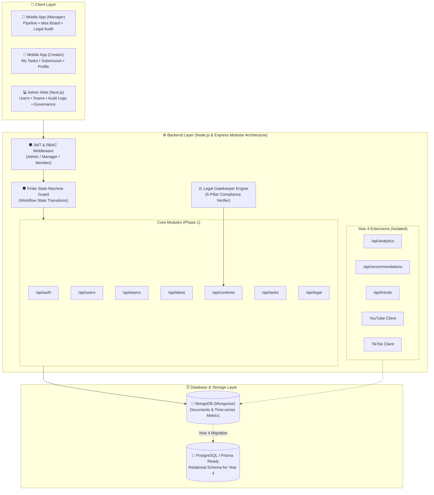

<div align="center">

# 🎬 Content Production Management System (CMS)
### Enterprise Media Lifecycle Architecture • Finite State Machine • Legal Gatekeeper • Cross-Platform

[](https://nodejs.org)
[](https://expressjs.com)
[](https://reactnative.dev)
[](https://nextjs.org)
[](https://www.mongodb.com)
[](https://prisma.io)
[](LICENSE)

<p align="center">
  ระบบบริหารจัดการกระบวนการผลิตสื่อครบวงจรระดับองค์กร (End-to-End Media Pipeline) ออกแบบตามหลักวิศวกรรมซอฟต์แวร์ (Software Engineering Standards)<br>
  พร้อมชุดเอกสารวิชาการมาตรฐานสากล (UML 2.5 / IEEE / Cockburn) สำหรับการประเมินผลและการต่อยอดสู่โครงงานปริญญานิพนธ์ปี 4 (Senior Capstone Project)
</p>

[📌 ภาพรวมระบบ](#-ภาพรวมระบบ-system-overview) •
[🏛️ สถาปัตยกรรม](#️-สถาปัตยกรรมระบบ-architecture) •
[👥 สิทธิ์ผู้ใช้ (RBAC)](#-บทบาทและสิทธิ์ผู้ใช้งาน-rbac) •
[📚 8 เอกสารวิชาการ](#-ชุดเอกสารวิชาการ-academic-deliverables) •
[🚀 พิมพ์เขียวปี 4](#-พิมพ์เขียวโครงงานปี-4-senior-capstone-blueprint) •
[⚡ วิธีการติดตั้งและรัน](#-วิธีการติดตั้งและเริ่มต้นใช้งาน-quickstart)

---

</div>

## 📌 ภาพรวมระบบ (System Overview)

**Content Production Management System** ถูกออกแบบขึ้นเพื่อแก้ปัญหาความวุ่นวาย (Spaghetti Operations) ในสตูดิโอผู้ผลิตสื่อ โดยเปลี่ยนการทำงานที่กระจัดกระจายบนแชตและชีต สู่ **ระบบสายการผลิตสื่อแบบ State Machine อัจฉริยะ**:

$$\text{Idea} \rightarrow \text{Planning} \rightarrow \text{Task Assignment} \rightarrow \text{Production} \rightarrow \text{Legal Check} \rightarrow \text{Review} \rightarrow \text{Revision} \circlearrowleft \rightarrow \text{Approval} \rightarrow \text{Schedule} \rightarrow \text{Publish} \rightarrow \text{Analytics}$$

### 🌟 ฟีเจอร์เด่นระดับ Enterprise (Core Capabilities)
1. **🛡️ Finite State Machine (FSM) Guard**: ป้องกันการข้ามขั้นตอนโดยพลการ (เช่น บล็อกไม่ให้กระโดดจาก `PLANNING` ตรงไป `PUBLISHED` โดยไม่มีชิ้นงานหรือการตรวจรับรอง)
2. **⚖️ 5-Pillar Legal & Compliance Gatekeeper**: ด่านตรวจข้อกฎหมายภาคบังคับ 5 ประการ (Music License, Stock Footage, PDPA Consent, Trademark Disclosure, Community Rules) **บล็อกการอนุมัติและเผยแพร่เด็ดขาดหากไม่ผ่านเกณฑ์ 100%**
3. **🔄 Real-time Review & Revision Loop**: ระบบตรวจงานที่ Creator แนบ Submission Link (Drive / Frame.io) $\rightarrow$ ระบบอัปเดตเวอร์ชันใหม่ (v1, v2...) และส่งต่อเข้าสู่คิวตรวจของ Manager พร้อมประวัติบันทึกการสั่งแก้ (Review History)
4. **📱 Multi-Platform Client Ecosystem**:
   - **Admin Web (Next.js)**: สำหรับควบคุมนโยบาย, จัดการ Users/Teams, Task Types, กฎหมาย และ System Audit Logs
   - **Mobile App (React Native)**: มี Bottom Tab Bar รองรับทั้งมุมมอง **Manager Dashboard** (ภาพรวมสายการผลิต) และ **Creator Workbench** (โต๊ะทำงานส่งมอบผลงาน)

---

## 🏛️ สถาปัตยกรรมระบบ (Architecture)



---

## 👥 บทบาทและสิทธิ์ผู้ใช้งาน (RBAC)

ระบบใช้มาตรฐาน Role-Based Access Control ตรวจสอบสิทธิ์ที่ Backend เสมอ:

| สิทธิ์การใช้งาน (Permissions) | 👤 Admin (Web) | 👔 Manager (Mobile) | 🎨 Member (Mobile) |
| :--- | :---: | :---: | :---: |
| **เข้าสู่ระบบ (Login / 2FA)** | ✅ | ✅ | ✅ |
| **จัดการผู้ใช้งานและสิทธิ์ (Manage Users)** | ✅ | ❌ | ❌ |
| **จัดการโครงสร้างทีม (Manage Teams)** | ✅ | ✅ | ❌ |
| **เสนอและโหวตไอเดีย (Propose & Vote Ideas)** | ✅ | ✅ | ✅ |
| **อนุมัติไอเดียเป็นชิ้นงาน (Approve Ideas)** | ✅ | ✅ | ❌ |
| **สร้าง Content และมอบหมาย Task** | ✅ | ✅ | ❌ |
| **รับงานและส่งมอบผลงาน (Submit Deliverable)** | ❌ | ❌ | ✅ |
| **ตรวจงานและสั่งแก้ไข (Review & Request Revision)** | ❌ | ✅ | ❌ |
| **ตรวจสิทธิ์กฎหมาย (Audit Legal Checklist)** | ❌ | ✅ | ❌ |
| **อนุมัติขั้นสุดท้ายและเผยแพร่ (Approve & Publish)** | ❌ | ✅ | ❌ |
| **ตรวจสอบ Audit Logs และ System Monitor** | ✅ | ❌ | ❌ |

---

## 📚 ชุดเอกสารวิชาการ (Academic Deliverables)

เอกสารทั้ง 8 ฉบับถูกจัดทำตามระเบียบแบบแผน Software Engineering เพื่อใช้ส่งอาจารย์และนำไปขึ้น Figma Prototype 1:1:

| เอกสารวิชาการ | รายละเอียดเนื้อหา | ลิงก์เอกสาร |
| :--- | :--- | :---: |
| **1. Use Case Diagram** | แผนภาพ Use Case Diagram (UML) ครอบคลุม 3 Actors + External APIs พร้อม Include/Extend | [📄 ดูเอกสาร](docs/academic/01-Use-Case-Diagram.md) |
| **2. Use Case Descriptions** | Fully Dressed Specification (Cockburn/IEEE) สำหรับ 6 เวิร์กโฟลว์หลัก | [📄 ดูเอกสาร](docs/academic/02-Use-Case-Descriptions.md) |
| **3. Activity Diagram** | Swimlane 4 เลน (Creator, Manager, System, Platform) + FSM Lifecycle | [📄 ดูเอกสาร](docs/academic/03-Activity-Diagram.md) |
| **4. Domain Class Diagram** | แผนภาพคลาส 11 โดเมนเอนทิตี พร้อม Attributes, Visibility, Multiplicities | [📄 ดูเอกสาร](docs/academic/04-Domain-Class-Diagram.md) |
| **5. Sequence Diagrams** | 3 ไดอะแกรมสำหรับ Critical Paths (Task Assignment, Revision, Legal Gatekeeper) | [📄 ดูเอกสาร](docs/academic/05-Sequence-Diagrams.md) |
| **6. Relational ERD** | Crow's Foot ERD 12 ตาราง พร้อมบทวิเคราะห์สถาปัตยกรรม Hybrid Database | [📄 ดูเอกสาร](docs/academic/06-Entity-Relationship-Diagram.md) |
| **7. Data Dictionary** | พจนานุกรมข้อมูลครบถ้วนทุกคอลัมน์ ชนิดข้อมูล ข้อจำกัด และค่าเริ่มต้น | [📄 ดูเอกสาร](docs/academic/07-Data-Dictionary.md) |
| **8. Figma Blueprint** | Design Tokens (Colors, Typography, 8pt Grid) และผังหน้าจอสำหรับขึ้น Figma | [📄 ดูเอกสาร](docs/academic/08-Figma-Design-Tokens-And-Wireframes.md) |

---

## 🚀 พิมพ์เขียวโครงงานปี 4 (Senior Capstone Blueprint)

เพื่อไม่ให้โค้ดส่วนต่อขยายมารบกวนระบบ Core ในเทอมปัจจุบัน จึงได้แยกพิมพ์เขียวสำหรับปี 4 ไว้ใน [`docs/year-4-capstone/`](docs/year-4-capstone/):

1. **[01-Scope-And-Phasing-Matrix.md](docs/year-4-capstone/01-Scope-And-Phasing-Matrix.md)** — ตารางเปรียบเทียบขอบเขตงานระบบปัจจุบัน vs ระบบอัจฉริยะปี 4
2. **[02-Content-Intelligence-Specification.md](docs/year-4-capstone/02-Content-Intelligence-Specification.md)** — สเปกเชื่อมต่อ YouTube Data API v3 & TikTok Display API และ Ingestion Worker
3. **[03-Recommendation-Engine-Architecture.md](docs/year-4-capstone/03-Recommendation-Engine-Architecture.md)** — สถาปัตยกรรมระบบแนะนำ: Rule-Based Heuristic สู่ Machine Learning
4. **[04-Automated-Legal-AI-Audit.md](docs/year-4-capstone/04-Automated-Legal-AI-Audit.md)** — ระบบ AI ตรวจลิขสิทธิ์เพลง (Audio Fingerprinting), PDPA (Face Detection) และ OCR
5. **[05-Cloud-Object-Storage-Pipeline.md](docs/year-4-capstone/05-Cloud-Object-Storage-Pipeline.md)** — สถาปัตยกรรม Direct-to-Cloud Upload ด้วย Presigned URLs (AWS S3)
6. **[06-PostgreSQL-Prisma-Migration-Schema.md](docs/year-4-capstone/06-PostgreSQL-Prisma-Migration-Schema.md)** — Prisma Schema (`schema.prisma`) ฉบับสมบูรณ์ 100% สำหรับการย้ายฐานข้อมูลสู่ PostgreSQL ในปี 4

---

## 📂 โครงสร้างโปรเจกต์ (Project Structure)

```text
Content-Management-System/
├── docs/                           <-- 📚 คลังเอกสารรายงานและพิมพ์เขียววิชาการ
│   ├── academic/                   <-- 7 UML Diagrams + Figma Blueprint (ส่งอาจารย์)
│   ├── year-4-capstone/            <-- พิมพ์เขียวและสถาปัตยกรรมสำหรับต่อยอดปี 4
│   ├── master/                     <-- คู่มืออธิบายการทำงานของระบบ Master
│   ├── learning/                   <-- บทเรียนลงมือเขียนโค้ดด้วยตัวเองทีละบรรทัด
│   └── PROJECT-DEVELOPMENT-LOG.md  <-- บันทึกประวัติและไทม์ไลน์การพัฒนาทั้งหมด
│
├── master/                         <-- 🏆 [ระบบเต็มฉบับสมบูรณ์]
│   ├── backend/                    <-- Node.js + Express API + State Machine
│   │   └── src/
│   │       ├── modules/            <-- Core API (Auth, Users, Teams, Ideas, Contents, Tasks, Legal)
│   │       ├── year4-extensions/   <-- โมดูลอัจฉริยะรอต่อยอดปี 4 (Analytics, Recs, Trends)
│   │       └── integrations/       <-- Template เชื่อมต่อ YouTube & TikTok
│   ├── admin-web/                  <-- Next.js Admin Dashboard (.jsx ล้วน 100%)
│   ├── mobile-app/                 <-- React Native Mobile App (Manager & Member Flow)
│   └── database/                   <-- PostgreSQL schema.sql ดั้งเดิม
│
└── learning/                       <-- ✍️ [พื้นที่ฝึกฝนของคุณ] เริ่มเขียนโค้ดจากศูนย์
    └── backend/                    <-- บทเรียน Node.js + Express + Mongoose
```

---

## ⚡ วิธีการติดตั้งและเริ่มต้นใช้งาน (Quickstart)

### 1. ความต้องการของระบบ (Prerequisites)
- **Node.js**: v20.x ขึ้นไป
- **MongoDB**: Community Server รันอยู่ที่ `mongodb://127.0.0.1:27017`
- **Android Studio**: สำหรับเปิดรัน Android Emulator (API 34+)

---

### 2. รัน Backend API
```bash
cd master/backend
npm install

# จำลองข้อมูล Mock Data เริ่มต้น (Users, Teams, Ideas, Contents, Tasks)
npm run seed

# เริ่มต้นเซิร์ฟเวอร์ (รันบน Port 5000)
npm run dev
# หรือ npm start
```
> ทดสอบ Health Check ได้ที่: `http://localhost:5000/api/health`

---

### 3. รัน Admin Web Dashboard
```bash
cd master/admin-web
npm install
npm run dev
```
> เปิดเบราว์เซอร์ที่: `http://localhost:3000`

---

### 4. รัน Mobile Application (Android)
```bash
cd master/mobile-app
npm install

# Start Metro Bundler
npm start

# รันแอปพลิเคชันลงใน Android Emulator (เปิด Emulator ทิ้งไว้ก่อนรันคำสั่ง)
npm run android
```
*(หมายเหตุ: บน Android Emulator ตัวแอปเชื่อมต่อ Backend ที่เครื่อง Host ผ่าน `http://10.0.2.2:5000/api` อัตโนมัติ)*

---

## 🔐 บัญชีสำหรับทดสอบระบบ (Default Credentials)

ข้อมูลบัญชีเริ่มต้นที่ถูกสร้างโดย `npm run seed`:

| บทบาท (Role) | อีเมล (Email) | รหัสผ่าน (Password) | ฟังก์ชันหลักที่เข้าถึงได้ |
| :--- | :--- | :--- | :--- |
| **Manager** | `manager@studio.com` | `123456` | Pipeline Dashboard, อนุมัติไอเดีย, ตรวจงาน, Legal Audit, Publish |
| **Member** | `member@studio.com` | `123456` | โต๊ะทำงาน Creator, ส่งมอบ Submission URL, เสนอไอเดีย |
| **Admin** | `admin@studio.com` | `123456` | จัดการผู้ใช้งาน, จัดการทีม, กำหนดประเภทงาน, ดู Audit Logs |

*(บน Mobile App มีปุ่ม **Fast Role Switcher** ในหน้า Login ให้สามารถคลิกเพื่อสลับบทบาททดสอบได้ทันที)*

---

## 📜 บันทึกประวัติการพัฒนา (Development Log)
ประวัติการพัฒนาทีละขั้นตอนพร้อมระบุวันและเวลาอย่างละเอียด บันทึกไว้ใน:
👉 **[PROJECT-DEVELOPMENT-LOG.md](docs/PROJECT-DEVELOPMENT-LOG.md)**

---

<div align="center">
  <sub>Developed with pride by Developer & Pair Programmed with Antigravity AI • 2026</sub>
</div>
