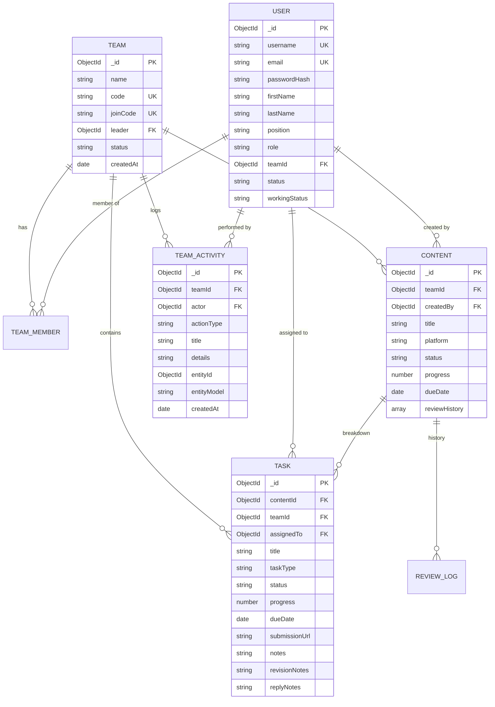
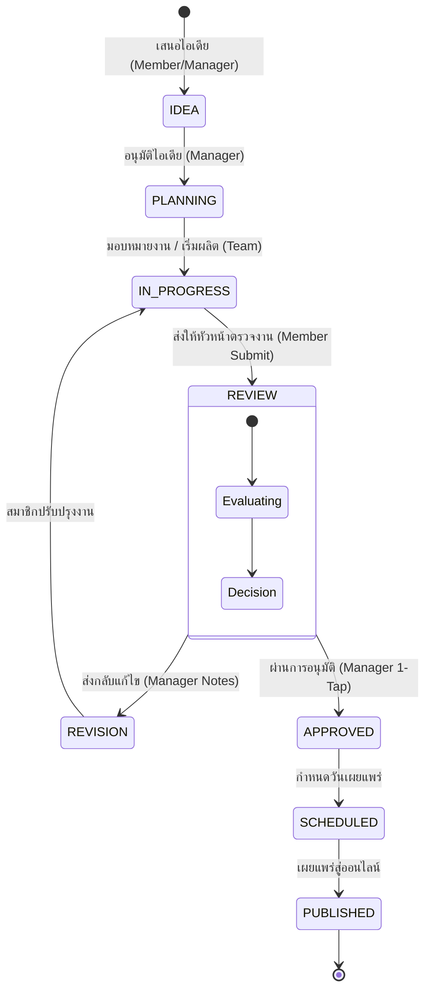
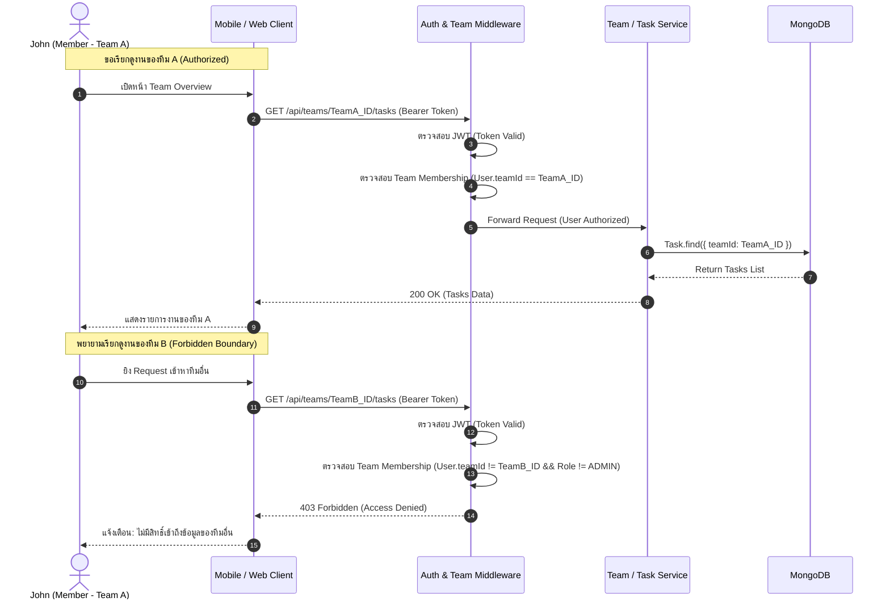
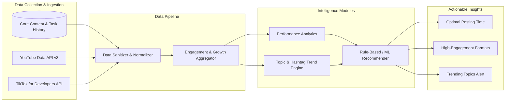

# Architecture & Implementation Plan: Team-Based Content Production Management System

## Goal Description
ยกระดับสถาปัตยกรรมระบบ Draftly Content Production Management System ให้มีความสมจริงตามมาตรฐานระบบปฏิบัติการของบริษัทสื่อ (Corporate Media Production Environment) โดยยึดขอบเขตงานเดิม (Core Scope) เป็นหลัก ไม่เพิ่มฟีเจอร์ที่ไม่จำเป็น (เช่น Chat, AI Chatbot, หรือ Microservices) แต่มุ่งเน้นการเพิ่มความลึกของ Business Logic, การแบ่งแยกบทบาทหน้าที่และสิทธิ์การเข้าถึงอย่างชัดเจน (RBAC & Team Isolation), สถาปัตยกรรม Service Layer, ระบบเข้าร่วมทีมด้วย Join Code, Content/Task Workflow State Machine ที่เข้มงวด, และตรวจสอบความสอดคล้องกันแบบ 100% (End-to-End System Consistency) ทั่วทั้งระบบ Database, Backend, Mobile App, Admin Web และเอกสารวิชาการ

> **คำสั่งเพิ่มเติมจากผู้ใช้งาน**: 
> 1. ลบระบบ, ฟิลด์, และข้อมูลที่เกี่ยวข้องกับข้อกฎหมาย (Legal Check & Compliance Checklist) ออกจากระบบและ **Database** ทั้งหมดอย่างสิ้นเชิง
> 2. ตรวจสอบความสอดคล้อง (Consistency Check) ของทุกส่วนในระบบให้ตรงกันจริง ๆ (Enums, Status, APIs, Models, Seed Data, UI Labels)
> 3. ผนวกแผนการต่อยอดสู่ปี 4 (**Year 4 Extension / Capstone Architecture**) โดยไม่รื้อ Core System แต่ใช้ระบบปัจจุบันเป็นฐานรากที่แข็งแกร่ง

---

## System Consistency Matrix (ตารางตรวจสอบความสอดคล้องทั่วทั้งระบบ)

เพื่อให้แน่ใจว่าทุกส่วนเชื่อมโยงและใช้มาตรฐานเดียวกันอย่างแท้จริง:

| หัวข้อข้อมูล | MongoDB / Mongoose Schema | Backend Service / API | Mobile App (React Native) | Admin Web (Next.js) | Seed Script & Documentation |
| :--- | :--- | :--- | :--- | :--- | :--- |
| **System Role** | `['ADMIN', 'MANAGER', 'MEMBER']` | RBAC Middleware (`verifyRole`) | สลับ Navigator (`Manager` vs `Member`) | สิทธิ์ Admin ใน Topbar / Sidebar | ค่าเริ่มต้นผู้ใช้ใหม่ = `MEMBER` |
| **Job Position** | `['Video Editor', 'Graphic Designer', 'Script Writer', 'Content Creator', 'Production Manager', 'Other']` | รับผ่าน `register`, คืนค่าใน JWT & `/auth/me` | แสดงใน Profile, การ์ดสมาชิก และหน้าลงทะเบียน | คอลัมน์ "ตำแหน่ง (Position)" ใน `/users` | Seed ทุกคนมี Position ตรงตามสายงาน |
| **Content Status** | `['IDEA', 'PLANNING', 'IN_PROGRESS', 'REVIEW', 'REVISION', 'APPROVED', 'SCHEDULED', 'PUBLISHED']` | `workflow.service.validateContentTransition` | แสดง Filter & Status Pills ตรงกัน | แสดง Badge & Table Filter ใน `/contents` | ล้างสถานะ `PRODUCTION` เดิมและไม่มี `LEGAL_CHECK` |
| **Task Status** | `['TODO', 'IN_PROGRESS', 'REVIEW', 'REVISION', 'DONE']` | `workflow.service.validateTaskTransition` | ป้ายสถานะ 5 สีใน `MemberTaskList` และ `TeamOverview` | สถานะ Task ใน `/tasks` | ตรงตาม Cockburn Use Case & State Machine |
| **Task Types** | `['Scripting', 'Filming', 'Editing', 'Graphic Design', 'Sound Design', 'Other']` | กรองตามประเภทงาน | ไอคอนและป้ายระบุประเภทงาน | ตัวเลือกประเภทงานใน Modal สร้าง Task | ตัด `'Legal Check'` ออก 100% |
| **Team Identifier** | `code: String` (เช่น `TEAM-A`), `joinCode: String` (เช่น `K7P92X`) | ตรวจสอบผ่าน `POST /teams/join` | ป้ายรหัสทีม 6 หลัก + ปุ่มคัดลอก/สร้างใหม่ | ช่องระบุรหัสทีมในสร้างทีม | Seed: Team A (`TEAM01`), Team B (`TEAM02`) |
| **Team Isolation** | `teamId` Index บน `Content`, `Task`, `User` | `verifyTeamAccess` คืน `403` หากข้ามทีม | สมาชิกเห็นเฉพาะงานของทีมตนเอง | Admin มองเห็นภาพรวมทุกทีมได้ | ทดสอบ John (Team A) เข้า Team B ถูกปฏิเสธ |

---

## User Review Required

> [!IMPORTANT]
> **1. การแยก Position, Role, และ Team อย่างเด็ดขาด**:
> - **Position (หน้าที่งาน/ตำแหน่งวิชาชีพ)**: เช่น `Video Editor`, `Graphic Designer`, `Script Writer`, `Content Creator` (ใช้ระบุความเชี่ยวชาญและการมอบหมายงาน)
> - **Role (สิทธิ์ในระบบ)**: `ADMIN`, `MANAGER`, `MEMBER` (ใช้ควบคุม Authorization / RBAC เท่านั้น)
> - **Team (องค์กร/ทีมที่สังกัด)**: Entity แยกต่างหาก โดยผู้ใช้ 1 คนจะสังกัดได้ 1 ทีมในเวลาเดียวกัน (Single Active Team Policy) เพื่อความเรียบง่ายและปลอดภัยของสิทธิ์การเข้าถึง

> [!WARNING]
> **2. การลงทะเบียน (Register Flow) แบบสมจริง**:
> - ผู้ใช้งานทั่วไปที่สมัครสมาชิกผ่านหน้า Register จะได้รับ Role เป็น `MEMBER` โดยอัตโนมัติ (ไม่สามารถเลือก Role เป็น ADMIN หรือ MANAGER เองได้ เพื่อป้องกัน Privilege Escalation)
> - ไม่บังคับกรอก Team Code ในขั้นตอนสมัครสมาชิก
> - ผู้ใช้ที่ยังไม่มีทีม เมื่อ Login เข้าสู่ระบบจะพบหน้าจอเข้าร่วมทีม (Join Team) ด้วยรหัส 6 หลัก (Join Code) หรือหากได้รับสิทธิ์เป็น Manager จาก Admin จะสามารถสร้างทีมใหม่ได้

> [!NOTE]
> **3. รหัสเข้าร่วมทีม (Team Join Code)**:
> - ใช้รหัสสุ่ม 6 ตัวอักษร Alphanumeric พิมพ์ใหญ่ (เช่น `K7P92X`)
> - Manager และ Admin สามารถดูรหัส, คัดลอก, และสร้างรหัสใหม่ (Regenerate Code) ได้ตลอดเวลา

> [!CAUTION]
> **4. การล้างข้อมูลและ Schema ด้าน Legal ออกจาก Database อย่างสิ้นเชิง**:
> - ลบ `legalChecklist` schema และ default subdocuments ออกจากโมเดล `Content.js`
> - ตัด `'Legal Check'` ออกจาก enum `taskType` ในโมเดล `Task.js`
> - ล้างฟิลด์ `legalChecklist` ออกจาก `seed.js` และรันล้างข้อมูลเดิมใน MongoDB `content_management` (ผ่าน `$unset` และ `npm run seed`)
> - ลบ endpoint `PUT /api/contents/:id/legal-check` และ Gatekeeper check ใน backend ทั้งหมด

---

## Architecture & System Design

### 1. Conceptual Domain & Entity Model (Cleaned of Legal)



---

### 2. Streamlined Content Workflow State Transition Machine



---

### 3. Team Authorization & Isolation Flow



---

## Year 4 Capstone Extension Architecture (การต่อยอดสู่ปี 4)

### 1. Vision & Strategy: จาก "จัดการงาน" สู่ "Intelligence Platform"
- **ระบบปีปัจจุบัน (Year 3 Core)**: *"Team-Based Content Production Management System"* มุ่งเน้นการจัดการสายพานการผลิต, เวิร์กโฟลว์, ตรวจงาน, แยกสิทธิ์ตามทีม, ความโปร่งใสของความคืบหน้า (Operational Focus)
- **ระบบปี 4 (Year 4 Capstone)**: *"Organization-Based Content Production Intelligence Platform"* ต่อยอดจากฐานข้อมูล Core โดย **ไม่รื้อ Core System เดิม** แต่เพิ่มความฉลาด (Intelligence), การเชื่อมต่อ Platform จริง, และการรองรับหลายองค์กร (Multi-Tenant)

```
                 Mobile App
                     │
                  Admin Web
                     │
                     ▼
              Backend API
                     │
       ┌─────────────┼─────────────┐
       │             │             │
       ▼             ▼             ▼
    Core System   Intelligence  Organization
       │             │             │
   Content        Analytics      Tenant
   Task           Trend          Isolation
   Workflow       Recommend      Permission
   Review
       │             │
       └──────┬──────┘
              ▼
           Database
              │
       ┌──────┴──────┐
       ▼             ▼
 YouTube API     TikTok API
```

---

### 2. Multi-Tenant Organization Structure (ปี 4)

โครงสร้างการจัดระดับสิทธิ์และการแยกข้อมูล (Data Isolation):

```
PLATFORM
│
├── ORGANIZATION A (เช่น Alpha Media Group)
│   ├── Admin (เห็นเฉพาะ Organization A)
│   ├── Team A (Manager + Members)
│   └── Team B (Manager + Members)
│
└── ORGANIZATION B (เช่น Studio Beta Corp)
    ├── Admin (เห็นเฉพาะ Organization B)
    ├── Team A (Manager + Members)
    └── Team B (Manager + Members)
```

**การออกแบบความเข้ากันได้ย้อนหลัง (Forward-Compatibility Design ในปีปัจจุบัน)**:
- ในปีปัจจุบัน Entity `User`, `Team`, `Content`, `Task` ถูกออกแบบให้ผูกผ่าน `teamId` และแยก Layer ใน `src/services/`
- เมื่อขึ้นสู่ปี 4 จะเพิ่มโมเดล `Organization` และเพิ่มฟิลด์ `organizationId` ให้กับ `Team` โดย **ไม่ต้องแก้ไข Schema ของ Task หรือ Content โดยตรง** เพราะสืบทอดความสัมพันธ์ผ่าน Team Isolation ที่เราวางไว้ในปัจจุบัน

---

### 3. Data Intelligence & Recommendation Architecture (ปี 4)



- **Analytics**: วิเคราะห์ Views, Likes, Comments, Shares, Engagement Rate, Watch Time, Average View Duration
- **Trend Analysis**: วิเคราะห์การเติบโต (+Growth Rate) ของหัวข้อและแฮชแท็ก เพื่อประกอบการตัดสินใจ
- **Recommendation Engine**: เริ่มต้นด้วย Rule-Based ในระยะแรก และพัฒนาสู่ Predictive Machine Learning เมื่อระบบสะสม Dataset จากการผลิตจริงมากเพียงพอ
- **External API Integrations**: แยกไดเรกทอรีการเชื่อมต่อภายนอกอย่างอิสระ:
  - `master/backend/src/integrations/youtube/`
  - `master/backend/src/integrations/tiktok/`

---

### 4. Roadmap การต่อยอด 5 ระยะ (Phasing Roadmap)

1. **Phase 1: Core System (ปีปัจจุบัน)**: ระบบ Content Production Management ใช้งานได้จริง, Workflow นิ่ง, RBAC & Team Isolation แน่นหนา, ไม่พึ่งพาฟีเจอร์ซับซ้อนเกินจำเป็น
2. **Phase 2: Data Intelligence (ต้นปี 4)**: ต่อยอด Analytics, Trend Dashboard, และ Recommendation จากประวัติงานที่ระบบปัจจุบันบันทึกไว้
3. **Phase 3: Integration (กลางปี 4)**: เชื่อมต่อ YouTube Data API และ TikTok API เพื่อดึง Performance สดจากโลกจริง
4. **Phase 4: Multi-Tenant Organizations (ปลายปี 4)**: ขยายสถาปัตยกรรมสู่ระดับ Multi-Tenant Platform
5. **Phase 5: Advanced AI/ML & Scalability (งานวิจัยปี 4)**: เพิ่มโมเดลคาดการณ์ Engagement และปรับแต่งความปลอดภัยระดับสากล

---

## Proposed Changes

การดำเนินการแบ่งออกเป็น 6 ส่วนหลักตาม Layered Architecture:

```
Request ──> Authentication ──> Authorization (RBAC & Team Isolation)
        ──> Validation ──> Controller ──> Service Layer ──> Model ──> MongoDB
```

---

### Layer 1: Database Models & Schemas

#### [MODIFY] `master/backend/src/database/models/User.js`
- เพิ่มฟิลด์ `position`:
  ```javascript
  position: {
    type: String,
    enum: ['Video Editor', 'Graphic Designer', 'Script Writer', 'Content Creator', 'Production Manager', 'Other'],
    default: 'Content Creator',
    trim: true,
  }
  ```
- ยืนยันฟิลด์ `role` เป็น enum: `['ADMIN', 'MANAGER', 'MEMBER']` (Default: `'MEMBER'`)
- ยืนยันฟิลด์ `teamId` ชี้ไปยัง `Team` ObjectId

#### [MODIFY] `master/backend/src/database/models/Team.js`
- เพิ่มฟิลด์ `joinCode`:
  ```javascript
  joinCode: {
    type: String,
    required: true,
    unique: true,
    uppercase: true,
    trim: true,
    length: 6,
  }
  ```
- เพิ่มฟิลด์ `leader`:
  ```javascript
  leader: {
    type: mongoose.Schema.Types.ObjectId,
    ref: 'User',
  }
  ```
- เพิ่มฟิลด์ `status`:
  ```javascript
  status: {
    type: String,
    enum: ['ACTIVE', 'ARCHIVED'],
    default: 'ACTIVE',
  }
  ```

#### [MODIFY] `master/backend/src/database/models/Content.js`
- **ลบ Legal Check ออกจาก Schema**:
  - ตัด `legalCheckItemSchema`
  - ตัด `DEFAULT_LEGAL_RULES`
  - ตัดฟิลด์ `legalChecklist`
- ปรับจูนสถานะให้ตรงตาม Streamlined Production Workflow:
  ```javascript
  status: {
    type: String,
    enum: ['IDEA', 'PLANNING', 'IN_PROGRESS', 'REVIEW', 'REVISION', 'APPROVED', 'SCHEDULED', 'PUBLISHED'],
    default: 'PLANNING',
  }
  ```

#### [MODIFY] `master/backend/src/database/models/Task.js`
- **ลบ Legal Check ออกจาก Schema**:
  - ตัด `'Legal Check'` ออกจาก `taskType` enum:
  ```javascript
  taskType: {
    type: String,
    enum: ['Scripting', 'Filming', 'Editing', 'Graphic Design', 'Sound Design', 'Other'],
    default: 'Editing',
  }
  ```

#### [MODIFY] `master/backend/src/database/models/TeamActivity.js`
- รองรับประเภทกิจกรรมของทีมให้ครอบคลุม:
  - `TEAM_CREATED`, `TEAM_JOINED`, `JOIN_CODE_REGENERATED`, `TASK_ASSIGNED`, `TASK_SUBMITTED`, `CONTENT_STATUS_CHANGED`, `REVIEW_REQUESTED`, `REVISION_REQUESTED`, `CONTENT_APPROVED`

---

### Layer 2: Service Layer (Business Logic Encapsulation)

#### [NEW] `master/backend/src/services/team.service.js`
- ฟังก์ชันจัดการทีมและตรรกะความปลอดภัย:
  - `generateUniqueJoinCode()`: สร้างรหัสสุ่ม 6 ตัวอักษรที่ไม่ซ้ำในฐานข้อมูล
  - `createTeam({ name, description, leaderId })`: สร้างทีมใหม่, กำหนด joinCode, แต่งตั้ง leader, เพิ่มเข้า members
  - `joinTeamByCode(userId, joinCode)`:
    - ตรวจสอบความถูกต้องของ joinCode
    - ตรวจสอบสถานะทีม (`ACTIVE`)
    - ตรวจสอบกฎ Single Active Team (ถอดออกจากทีมเดิมหรือป้องกันการเข้าซ้ำ)
    - ผูก user เข้ากับทีมและบันทึก `TeamActivity`
  - `regenerateJoinCode(teamId, requestedByUserId, userRole)`: ตรวจสอบสิทธิ์ (เฉพาะ Leader/Manager ของทีมหรือ Admin) แล้วออกรหัสใหม่ 6 หลัก
  - `getTeamDashboard(teamId, userId)`: รวมสถิติ Team Overview (My Tasks vs Team Tasks, สถานะงาน, ความคืบหน้าทีม %, สมาชิกและสถานะออนไลน์, Team Activity ล่าสุด)

#### [NEW] `master/backend/src/services/workflow.service.js`
- ฟังก์ชันตรวจสอบการเปลี่ยนสถานะงานและคอนเทนต์ (Workflow Engine):
  - `validateContentTransition(currentStatus, targetStatus, userRole)`:
    - ป้องกันไม่ให้ `MEMBER` กดย้ายสถานะข้ามไปเป็น `APPROVED` หรือ `PUBLISHED`
    - ตรวจสอบเส้นทางสถานะ: `IDEA` ➔ `PLANNING` ➔ `IN_PROGRESS` ➔ `REVIEW` (Manager ตัดสิน `REVISION` หรือ `APPROVED`) ➔ `SCHEDULED` ➔ `PUBLISHED`
    - อนุญาตให้ `MANAGER` สั่ง `REVISION` หรือ `APPROVED` ได้เท่านั้น
  - `validateTaskTransition(task, targetStatus, userId, userRole)`:
    - ป้องกันไม่ให้ `MEMBER` แก้ไข Task ของเพื่อนร่วมทีม
    - อนุญาตให้ Assignee เปลี่ยนเป็น `IN_PROGRESS` หรือ `REVIEW` (พร้อมส่ง `submissionUrl`)
    - อนุญาตให้ `MANAGER` สั่ง `DONE` หรือ `REVISION`

#### [NEW] `master/backend/src/services/auth.service.js`
- ฟังก์ชันการลงทะเบียนและการเข้าสู่ระบบ:
  - `register({ firstName, lastName, position, email, password })`:
    - ตรวจสอบอีเมลซ้ำ
    - บังคับ `role = 'MEMBER'` (ไม่อนุญาตให้เลือกระดับสิทธิ์เอง)
    - บันทึก `position`
    - ไม่บังคับใส่รหัสทีมตอนสมัคร (ทีมจะถูกผูกในขั้นตอนถัดไป)
  - `login({ email, password })`:
    - ตรวจสอบข้อมูลประจำตัว
    - คืนค่า Token, User Profile (พร้อม `position`, `role`, `teamId`)

---

### Layer 3: Backend Controller & Routing Refactor

#### [MODIFY] `master/backend/src/middleware/auth.js`
- ปรับปรุง `verifyTeamAccess`:
  - ตรวจสอบว่าผู้ใช้มี `teamId` ตรงกับ `:teamId` ใน Route หรือไม่
  - อนุญาต Admin ทุกกรณี
  - หากเป็น Member ที่พยายามเรียกดูข้อมูลของทีมอื่น ให้ส่ง HTTP `403 Forbidden` พร้อมข้อความแจ้งเตือนที่ชัดเจน

#### [MODIFY] `master/backend/src/modules/teams/teams.routes.js` & `teams.controller.js`
- เพิ่ม Endpoint:
  - `POST /api/teams/join`: เข้าร่วมทีมด้วย Join Code (Body: `{ joinCode }`)
  - `POST /api/teams/:id/regenerate-code`: ขอสร้าง Join Code ใหม่ (Manager/Admin Only)
- เชื่อมต่อการทำงานทั้งหมดเข้ากับ `team.service.js`

#### [MODIFY] `master/backend/src/modules/auth/auth.routes.js` & `auth.controller.js`
- ปรับปรุง Endpoint `POST /api/auth/register`:
  - รับฟิลด์: `firstName`, `lastName`, `position`, `email`, `password`
  - ตัดการเลือก `role` และการบังคับ `teamCode` ออกจากหน้า Register

#### [MODIFY] `master/backend/src/modules/tasks/tasks.controller.js`
- บังคับใช้การตรวจสิทธิ์รายชิ้นงาน:
  - `GET /api/tasks`: กรองเฉพาะงานใน `teamId` ของผู้ใช้งาน
  - `PATCH /api/tasks/:id/status`: ตรวจสอบผ่าน `workflow.service.validateTaskTransition` เพื่อไม่ให้ Member แก้ไขงานของคนอื่น

#### [MODIFY] `master/backend/src/modules/contents/contents.controller.js` & `contents.routes.js`
- **ลบ Legal Check**:
  - ลบฟังก์ชัน `updateLegalChecklist`
  - ลบ route `PUT /:id/legal-check`
  - ลบ Legal Gatekeeper ในการ Approve/Publish
- บังคับใช้การตรวจสิทธิ์และสถานะผ่าน `workflow.service.validateContentTransition`

---

### Layer 4: Seed Data & Database Purging

#### [MODIFY] `master/backend/src/database/seed.js`
- ล้าง `legalChecklist` ทั้งหมดออกจากทุก Content ใน Seed script
- อัปเดตข้อมูลบัญชีผู้ใช้งานให้มี `position` ครบถ้วน:
  - John Editor -> Position: `Video Editor`
  - Jane Script -> Position: `Script Writer`
  - Mike Graphic -> Position: `Graphic Designer`
  - Somsri Manager -> Position: `Production Manager`
  - Somchai Admin -> Position: `System Admin`
- อัปเดตทีมให้มี `joinCode` มาตรฐาน 6 หลัก:
  - Team A (`Content Team A`): `code: 'TEAM-A'`, `joinCode: 'TEAM01'` (หรือ `K7P92X`)
  - Team B (`Beta Studio`): `code: 'TEAM-B'`, `joinCode: 'TEAM02'` (หรือ `B9T4Q1`)
- สั่งรัน Seed เพื่อล้างคอลเลกชันเดิมใน MongoDB `content_management` และสร้างชุดข้อมูลใหม่ที่ไม่มีฟิลด์ Legal ใดๆ ตกค้าง

#### [MODIFY] `docs/academic/06-Entity-Relationship-Diagram.md` & `07-Data-Dictionary.md`
- อัปเดต Data Dictionary และ ERD ตัด Entity และ Attributes ด้าน Legal ออกอย่างสมบูรณ์ และเพิ่มฟิลด์ `position`, `joinCode` ให้ตรงกัน

---

### Layer 5: Mobile App UI/UX & Workflow Alignment

#### [MODIFY] `master/mobile-app/src/services/api.js`
- ลบ `updateLegalChecklist` ออกจาก `contentApi`
- เพิ่มฟังก์ชัน API ใน `teamApi`:
  - `joinTeam(joinCode)` -> `POST /teams/join`
  - `regenerateJoinCode(teamId)` -> `POST /teams/${teamId}/regenerate-code`
  - `createTeam(teamData)` -> `POST /teams`

#### [MODIFY] `master/mobile-app/src/features/dashboard/ManagerDashboard.jsx`
- ตัดการอ้างอิง `legalChecklist` ออกจาก state และ UI

#### [MODIFY] `master/mobile-app/src/features/auth/LoginScreen.jsx`
- ปรับปรุงแท็บ "สมัครสมาชิก (Register)":
  - แสดงช่องกรอก: ชื่อ, นามสกุล, ตำแหน่งงาน (Position Picker: Video Editor, Graphic Designer, Script Writer, Content Creator), อีเมล, รหัสผ่าน, ยืนยันรหัสผ่าน
  - ลบตัวเลือก Role (Admin/Manager/Member) ออก
  - ลบช่องบังคับกรอก Team Code ออก

#### [MODIFY] `master/mobile-app/src/features/team/TeamOverviewScreen.jsx`
- แสดงข้อมูลทีมอย่างสมบูรณ์:
  - ชื่อทีม และ Join Code 6 หลัก พร้อมปุ่ม "คัดลอกรหัส"
  - สำหรับ Manager: แสดงปุ่ม "สร้างรหัสใหม่ (Regenerate)"
  - แสดงรายชื่อสมาชิกในทีม พร้อมตำแหน่งงาน (Position), ระดับสิทธิ์ (Role), และสถานะออนไลน์/การทำงาน
  - แสดงกล่อง Team Activity Feed อัปเดตตามเวลาจริง (Real-time Timeline)
- กรณีผู้ใช้ยังไม่มีทีม:
  - แสดงหน้าต่างเข้าร่วมทีม (Join Team Form) ให้กรอกรหัส 6 หลัก
  - หากเป็น Manager: มีปุ่ม "สร้างทีมใหม่ (Create Team)"

#### [MODIFY] `master/mobile-app/src/features/profile/ProfileScreen.jsx`
- แสดงตำแหน่งงาน (Position) ชัดเจนในการ์ดข้อมูลบัญชี

#### [MODIFY] `master/mobile-app/src/features/tasks/MemberTaskList.jsx`
- ปรับมุมมองงานออกเป็น 2 แท็บ/ส่วน:
  1. **งานของฉัน (My Tasks)**: กรองเฉพาะงานที่ได้รับมอบหมาย สามารถส่งงาน แนบลิงก์ผลงาน และตอบกลับข้อคิดเห็นได้
  2. **งานทั้งหมดของทีม (Team Overview Tasks)**: สามารถดูความคืบหน้าของเพื่อนร่วมทีมทุกคนในทีมเดียวกันได้ (เห็นผู้รับผิดชอบ, สถานะ, ความคืบหน้า, กำหนดส่ง) แต่ไม่มีปุ่มแก้ไขงานของคนอื่น

---

### Layer 6: Admin Web Portal Alignment

#### [MODIFY] `master/admin-web/src/app/users/page.jsx`
- เพิ่มคอลัมน์ "ตำแหน่งหน้าที่ (Position)" ในตาราง User Management
- เพิ่มตัวเลือก Position ตอนสร้าง/แก้ไขผู้ใช้
- อัปเดต Modal สร้าง Team ให้รองรับและแสดง Join Code

#### [MODIFY] `master/admin-web/src/app/contents/page.jsx`
- ตัดการอ้างอิงสถานะ `PRODUCTION` เดิม และปรับสถานะเป็น `IN_PROGRESS` ให้ตรงกับระบบ Backend และ Mobile App 100%

---

## Verification Plan

### Automated / CLI Verification
1. **Backend Syntax Check**:
   ```powershell
   node -c master/backend/src/app.js
   node -c master/backend/src/services/team.service.js
   node -c master/backend/src/services/workflow.service.js
   node -c master/backend/src/services/auth.service.js
   ```
2. **Database Re-Seed & Verification**:
   ```powershell
   npm run seed --prefix master/backend
   ```
   - ยืนยันว่าคอลเลกชัน `contents` และ `tasks` ไม่มีฟิลด์หรือค่าที่เกี่ยวกับ Legal หลงเหลือใน MongoDB
   - ยืนยันว่าทุก User มี `position` และทุก Team มี `joinCode` ครบถ้วน
3. **API & RBAC Authorization Automated Test Script**:
   สร้างและรันสคริปต์ทดสอบอัตโนมัติใน PowerShell ตรวจสอบ 7 จุดสำคัญ:
   - สมาชิกสมัครใหม่ด้วย `POST /api/auth/register` ต้องได้ Role เป็น `MEMBER` เสมอ และบันทึก `position` ถูกต้อง
   - สมาชิกใช้ `POST /api/teams/join` ด้วย Join Code เพื่อเข้าร่วมทีมสำเร็จ
   - สมาชิกใน Team A สามารถดึงข้อมูล `GET /api/teams/TeamA/tasks` ได้สำเร็จ (`200 OK`)
   - สมาชิกใน Team A พยายามดึงข้อมูล `GET /api/teams/TeamB/tasks` ต้องถูกปฏิเสธด้วย `403 Forbidden`
   - สมาชิกพยายามปรับสถานะ Content เป็น `APPROVED` ต้องถูกปฏิเสธด้วย `403 Forbidden`
   - สมาชิกพยายามแก้ไข Task ของสมาชิกคนอื่น ต้องถูกปฏิเสธด้วย `403 Forbidden`
   - ผู้จัดการ (Manager) สามารถอนุมัติ Content (`APPROVED`) และขอแก้ไข (`REVISION`) ได้สำเร็จ
4. **Admin Web Build Check**:
   ```powershell
   cd master/admin-web; npm run build
   ```

### Manual / Visual Verification
1. **Mobile App Registration & Join Flow**:
   - ทดสอบเปิดแอปพลิเคชันบน Emulator (`emulator-5554`)
   - ทดสอบสมัครสมาชิกใหม่โดยเลือกตำแหน่งงาน
   - ล็อกอินเข้าสู่ระบบและทดสอบการกรอก Join Code เพื่อเข้าทีม
   - ตรวจสอบหน้า Team Overview ว่าแสดง Join Code, สมาชิก, และ Team Activity ชัดเจน
   - ตรวจสอบหน้า My Tasks และ Team Tasks ว่าแสดงผลถูกต้องตามสิทธิ์
2. **Admin Web Portal**:
   - ทดสอบเปิด `master/admin-web` ตรวจสอบหน้า `/users` ว่าแสดงคอลัมน์ Position และสังกัดทีมครบถ้วน
   - ตรวจสอบ Sidebar Navigation ว่าเปลี่ยนหน้าผ่าน Route จริง

---

## Development Logging & Remote Sync
- บันทึกรายละเอียดการดำเนินการทั้งหมดลงใน:
  - `docs/PROJECT-DEVELOPMENT-LOG.md`
  - `docs/PROJECT-DEVELOPMENT-LOG.html`
- ทำการ Commit และ Push ขึ้นสู่ GitHub `origin/main` อย่างสะอาดเรียบร้อย (ตามกฎข้อบังคับ AGENTS.md)
