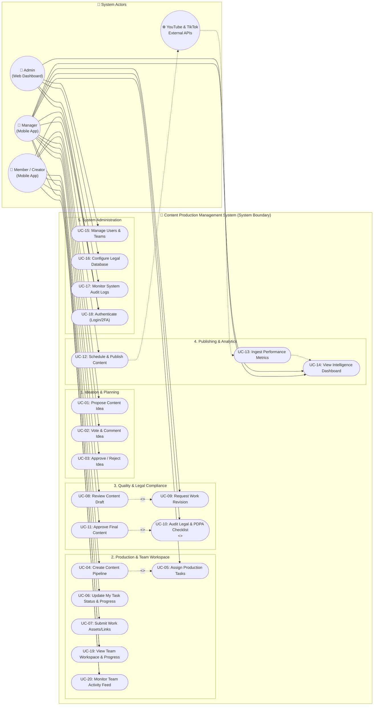

# 1. Use Case Diagram — Content Production Management System (CMS)

## 📌 บทนำและภาพรวมของระบบ
เอกสารนี้กำหนดขอบเขตของระบบ (System Boundary) และความสัมพันธ์ระหว่างผู้ใช้ (Actors) กับฟังก์ชันการทำงานหลัก (Use Cases) ของระบบ **Content Production Management System** เพื่อใช้สำหรับการวิเคราะห์และออกแบบระบบเชิงวัตถุ (OOAD) ในโครงงานระดับชั้นปีที่ 4 (Senior Capstone Project)

---

## 👥 นิยามผู้ใช้ระบบ (Actor Specifications)

ระบบแบ่งบทบาทผู้ใช้งานออกเป็น 3 บทบาทหลัก (Primary Actors) และ 1 ระบบภายนอก (Secondary/External Actor):

1. **Admin (ผู้ดูแลระบบ)**
   - รับผิดชอบงานด้าน Governance, Security, และ System Configuration
   - จัดการสิทธิ์ผู้ใช้งาน (Users & Roles), จัดสรรโครงสร้างทีม (Teams & Member Assignment)
   - กำหนดประเภทงานผลิต (Task Types) และข้อบังคับทางกฎหมาย (Legal Articles)
   - ตรวจสอบประวัติการใช้งานระบบผ่าน Audit Logs

2. **Manager (หัวหน้าทีมผู้ผลิต / บรรณาธิการ)**
   - ควบคุมกระบวนการผลิตสื่อตั้งแต่ต้นน้ำยันปลายน้ำผ่าน Mobile App
   - พิจารณาและอนุมัติไอเดียคอนเทนต์ (Content Ideas)
   - สร้างชิ้นงานคอนเทนต์ (Content) และมอบหมายงานย่อย (Task Assignment)
   - ตรวจสอบคุณภาพงาน (Content Review) สั่งแก้ไข (Revision) หรืออนุมัติ (Approve)
   - ทำหน้าที่เป็น **Legal Gatekeeper** ตรวจสอบรายการสิทธิ์ตามกฎหมาย (Music License, Stock, PDPA, Trademark, Community Guidelines)
   - กำหนดเวลาและคิวการเผยแพร่ (Scheduling & Publishing)

3. **Member (ทีมงานฝ่ายสร้างสรรค์: Creator, Editor, Graphic, Scriptwriter)**
   - เข้าใช้งานผ่าน Mobile App เพื่อจัดการงานที่ได้รับมอบหมาย
   - เสนอไอเดียคอนเทนต์ใหม่เข้าสู่คลังของสตูดิโอ (Idea Pitching)
   - อัปเดตสถานะงาน (`TODO` $\rightarrow$ `IN_PROGRESS` $\rightarrow$ `REVIEW`)
   - แนบหลักฐานส่งมอบผลงาน (File Asset / Google Drive / Frame.io Links)
   - รับข้อเสนอแนะและส่งงานรอบแก้ไข (Revision Delivery)

4. **External Platform APIs (ระบบเชื่อมต่อภายนอก - YouTube / TikTok Data APIs)**
   - Secondary Actor ที่ระบบทำการเชื่อมต่อเพื่อดึงสถิติยอดวิว, ยอดไลก์, คอมเมนต์, การแชร์ (Metrics Ingestion) และส่งข้อมูลตารางเผยแพร่

---

## 📊 Use Case Diagram (UML Notation via Mermaid)

---

## 📑 สรุปความสัมพันธ์แบบ Include และ Extend
1. **`<<include>>` UC-11 (Approve Final Content) $\rightarrow$ UC-10 (Audit Legal & PDPA Checklist)**:
   - การอนุมัติ Content ขั้นสุดท้ายต้องผ่านการตรวจสอบ Legal Checklist ครบทั้ง 5 ข้อเสมอ (Mandatory Gatekeeper)
2. **`<<include>>` UC-04 (Create Content Pipeline) $\rightarrow$ UC-05 (Assign Production Tasks)**:
   - การสร้าง Content เพื่อส่งเข้าสู่สายการผลิต จะต้องมีการแตก Task ย่อยและกำหนดผู้รับผิดชอบอย่างน้อย 1 คน
3. **`<<extends>>` UC-08 (Review Content Draft) $\leftarrow$ UC-09 (Request Work Revision)**:
   - เมื่อ Manager ตรวจสอบงานแล้วพบจุดบกพร่อง สามารถขยายกระบวนการเพื่อส่งข้อความสั่งแก้ไขงานพร้อมระบุ Timestamp จุดที่ต้องแก้ได้

