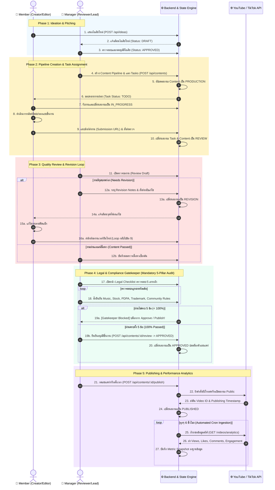
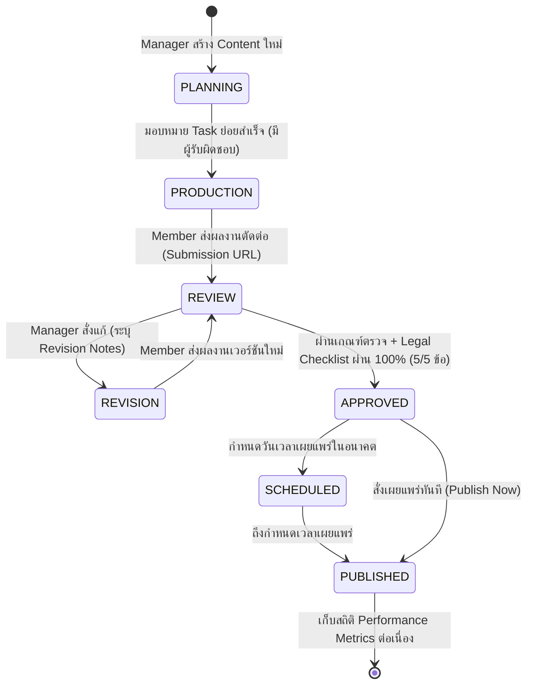

# 3. Activity Diagram (Swimlane Process Flow) — Content Production Management System

เอกสารนี้แสดงแผนภาพกิจกรรม (Activity Diagram) ในรูปแบบ **Swimlane (เลนแบ่งบทบาทหน้าที่)** เพื่ออธิบายการไหลของกระบวนการทำงานตั้งแต่ต้นน้ำ (การคิดไอเดีย) จนถึงปลายน้ำ (การเผยแพร่และเก็บสถิติ) พร้อมระบุ Decision Nodes, Fork/Join, และลูปการวนกลับแก้ไขงาน (Revision Loop) อย่างเป็นทางการ

---

## 🌊 แผนภาพกิจกรรมแบบ Swimlane (Mermaid UML)

---

## 🔄 State Machine Lifecycle Diagram (FSM)

แผนภาพแสดงการเปลี่ยนสถานะของ Entity `Content` ตามกฎ Business Rules ที่เข้มงวด:

---

## 🛑 กฎข้อห้ามของ State Machine (System Guard Invariants):
1. **ห้ามข้ามขั้นตอน (No State Skipping)**: 
   - `PLANNING` $\rightarrow$ `APPROVED` ❌ (ผิดกฎ ไม่อนุญาต)
   - `PRODUCTION` $\rightarrow$ `PUBLISHED` ❌ (ผิดกฎ ไม่อนุญาต)
2. **Legal Gatekeeper Invariant**:
   - `REVIEW` $\rightarrow$ `APPROVED` จะสำเร็จได้ก็ต่อเมื่อ `Content.legalChecklist` มีสถานะ `passed = true` ครบทั้ง 5 หัวข้อเท่านั้น
3. **Audit Trail Invariant**:
   - ทุกครั้งที่มีการเปลี่ยนสถานะ ระบบจะต้องสร้างระเบียนใน `ActivityLog` เพื่อระบุว่าใคร (`userId`), ทำอะไร (`action`), เวลาใด (`timestamp`), และสถานะก่อนหน้า/ใหม่ (`previousStatus`, `newStatus`)

