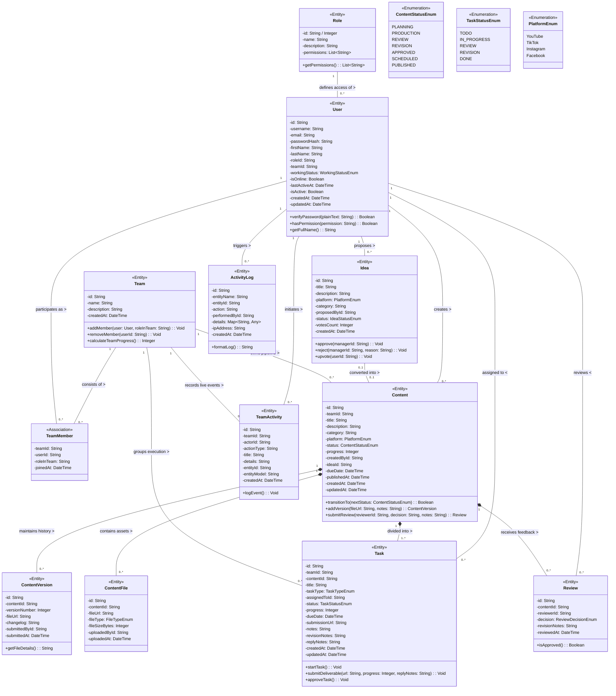

# 4. Domain Class Diagram — Content Production Management System

เอกสารนี้ระบุแผนภาพคลาสเชิงโดเมน (Domain Class Diagram) ในมาตรฐาน UML 2.5 ครอบคลุม **11 โดเมนเอนทิตี (Domain Entities)** ที่สะท้อนการทำงานของระบบจัดการการผลิตสื่อขนาดใหญ่ พร้อมระบุสมาชิก (Attributes), ระดับการเข้าถึง (Visibility: `+` Public, `-` Private, `#` Protected), ชนิดข้อมูล (Data Types), ความสัมพันธ์ (Multiplicity), และฟังก์ชันการทำงาน (Methods/Operations)

---

## 🏛️ Domain Class Diagram (Mermaid UML)

---

## 🔍 คำอธิบายความสัมพันธ์เชิงสถาปัตยกรรม (Architecture Associations)

1. **`Content` *-- `ContentVersion` (Composition 1 to 0..\*)**:
   - ความสัมพันธ์แบบ Composition หมายความว่าประวัติ Version ของ Content จะผูกพันกับตัว Content หาก Content ถูกลบ ประวัติเวอร์ชันจะสิ้นสภาพไปด้วย
   - ใช้สำหรับเก็บประวัติไฟล์งานแต่ละรอบที่ส่งตรวจ (เช่น v1, v2 หลังสั่งแก้)

2. **`Task` Revision & Reply Flow (Tracking Invariant)**:
   - แต่ละ Task รองรับวงจรส่งกลับแก้ไขผ่านฟิลด์ `revisionNotes` (คำแนะนำจาก Manager) และ `replyNotes` (ข้อความตอบกลับชี้แจงการแก้ไขจาก Member)

3. **`Content` *-- `1..* Task` (Composition 1 to 1..\*)**:
   - Content ชิ้นหนึ่งต้องมีงานย่อยอย่างน้อย 1 งาน (เช่น การตัดต่อ Editing) จึงจะสามารถขยับสถานะจาก `PLANNING` ไปสู่ `PRODUCTION` ได้

