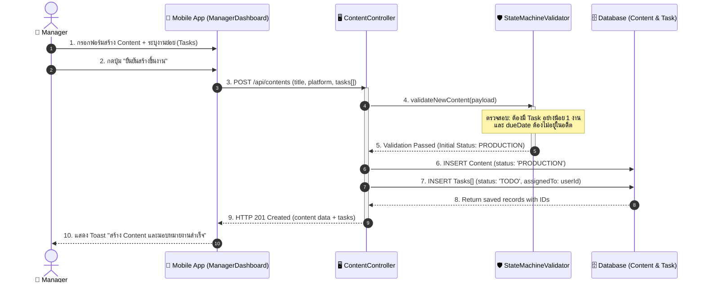
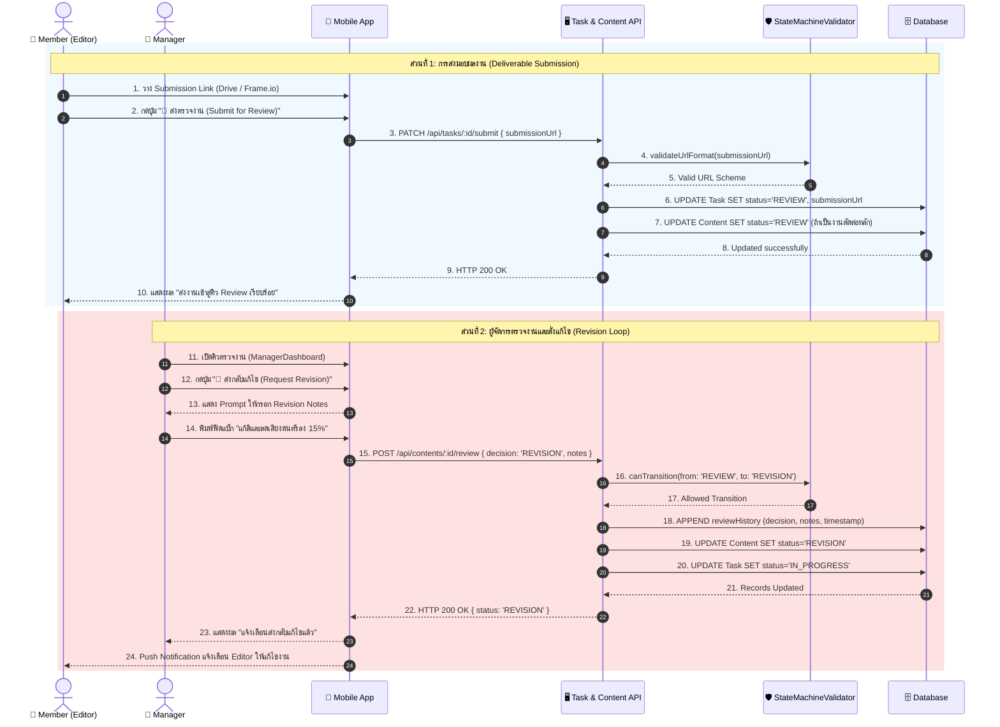
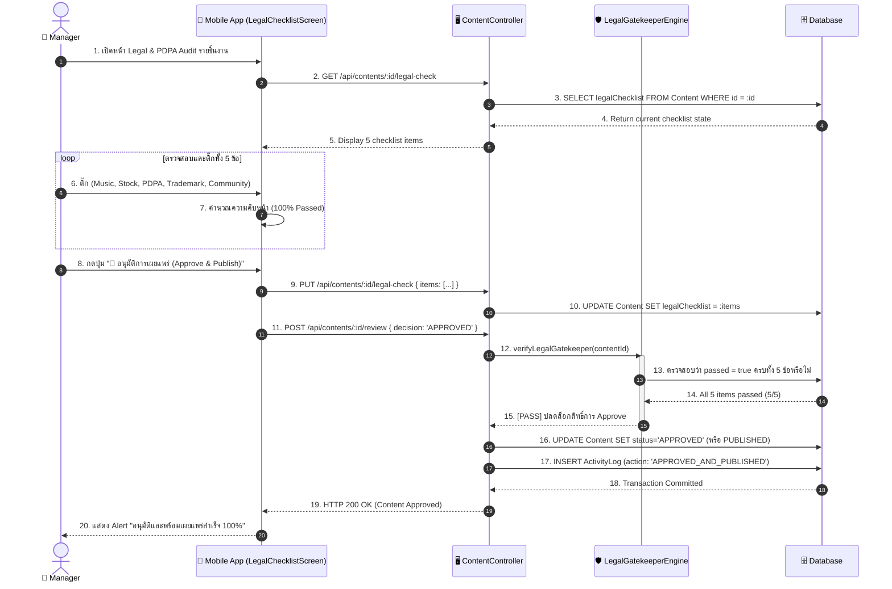
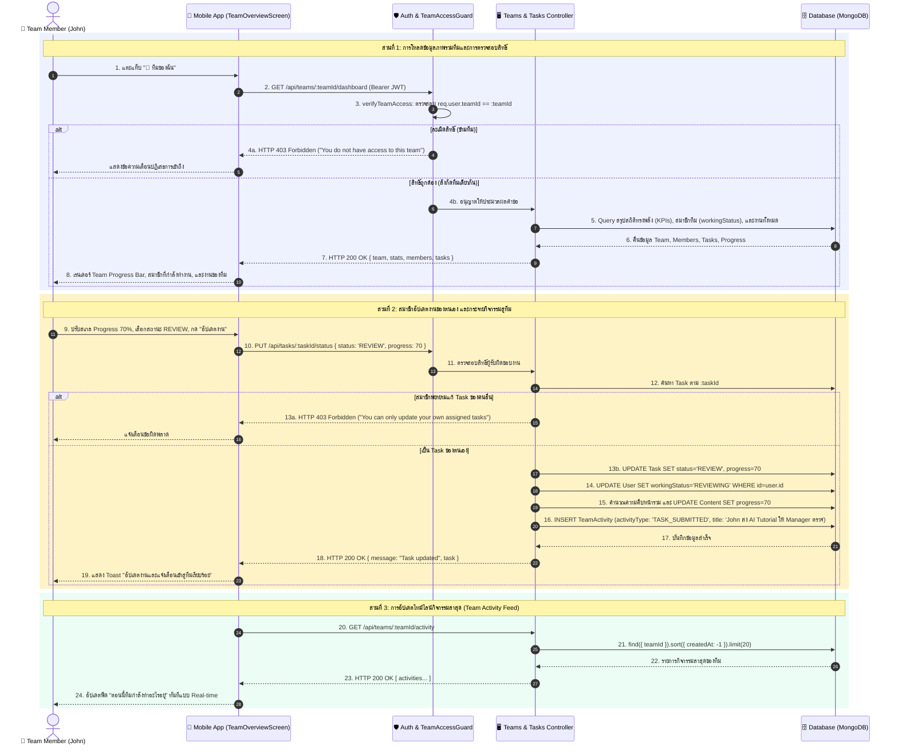

# 5. Sequence Diagrams — Content Production Management System

เอกสารนี้แสดงแผนภาพลำดับขั้นการทำงาน (Sequence Diagrams) ในมาตรฐาน UML เพื่ออธิบายอันดับของข้อความ (Messages) ที่ส่งผ่านระหว่าง Actor, Mobile App UI, API Controller, Workflow State Validator, และ Database Layer บน 3 กระบวนการทำงานวิกฤต (3 Critical Paths)

---

## 🎯 ไดอะแกรมที่ 1: การสร้าง Content และมอบหมายงาน (Content Creation & Task Assignment)

---

## 🔄 ไดอะแกรมที่ 2: การส่งงาน, ตรวจสอบ และสั่งแก้ไข (Task Submission, Review & Revision Loop)

---

## ⚖️ ไดอะแกรมที่ 3: การตรวจเช็กกฎหมายและอนุมัติเผยแพร่ (Legal Gatekeeper Audit & Publishing)

---

## 👥 ไดอะแกรมที่ 4: การเข้าถึงพื้นที่ทีมและการบันทึกกิจกรรมส่วนกลาง (Team Workspace Access & Event Dispatching)

