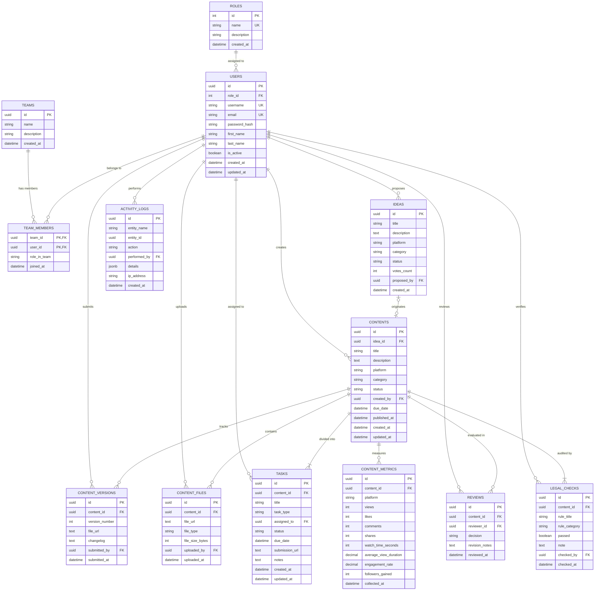

# 6. Entity-Relationship Diagram (ERD) — Relational & Document Data Models

เอกสารนี้ระบุแผนภาพความสัมพันธ์ของข้อมูล (Entity-Relationship Diagram - ERD) ในมาตรฐาน **Crow's Foot Notation** สำหรับสถาปัตยกรรม Relational Database (PostgreSQL / MySQL พร้อม Prisma ORM) ควบคู่กับคู่มือการแปลงสู่ Document Model (MongoDB Mongoose) เพื่อตอบคำถามคณะกรรมการสอบปริญญานิพนธ์ได้อย่างสมบูรณ์

---

## 📐 Relational ER Diagram (Crow's Foot Notation via Mermaid)

---

## 💡 แนวทางการตอบอาจารย์: ทำไมระบบจึงเหมาะกับสถาปัตยกรรม Hybrid (SQL + NoSQL)?

หากคณะกรรมการสอบถามว่า:
> *"ทำไมระบบจึงมีทั้งโมเดล Relational (SQL) และ Document (MongoDB)? เหตุใดจึงไม่เลือกแบบใดแบบหนึ่งไปเลย?"*

**คำตอบเชิงวิศวกรรมระดับเกียรตินิยม:**
1. **Core Workflow เป็น Relational Transactions (เหมาะกับ PostgreSQL / MySQL + Prisma)**:
   - ผู้ใช้, สิทธิ์ (RBAC), โครงสร้างทีม, และสถานะการส่งมอบงาน มีความสัมพันธ์แบบ Referential Integrity สูงมาก
   - ตัวอย่าง: หาก User ลาออกจากทีม Task ที่ค้างอยู่ต้องไม่เกิด Dangling Pointer, หรือการเปลี่ยนสถานะจาก Review ไป Approval ต้องเป็น ACID Transaction
2. **Metrics & Media Payloads เป็น Document / Time-Series (เหมาะกับ MongoDB)**:
   - สถิติจาก YouTube Data API v3 และ TikTok API มีโครงสร้าง JSON แบบกึ่งมีโครงสร้าง (Semi-structured) และมีการ Snap ข้อมูลเข้ามาทุกๆ 6 ชั่วโมง
   - การเก็บ `metrics` แบบ Embedded Subdocuments ใน NoSQL ช่วยให้ดึงข้อมูลกราฟแนวโน้ม (Time-series trends) ได้รวดเร็วโดยไม่ต้อง Join ตารางนับล้านแถว
3. **Legal Checklist Compliance**:
   - การเก็บ Checklist 5 ข้อแบบ Embedded Array ใน MongoDB ช่วยให้การตรวจสอบ Gatekeeper ทำได้เร็วแบบ $O(1)$ ในการโหลด Content Object เพียงครั้งเดียว

