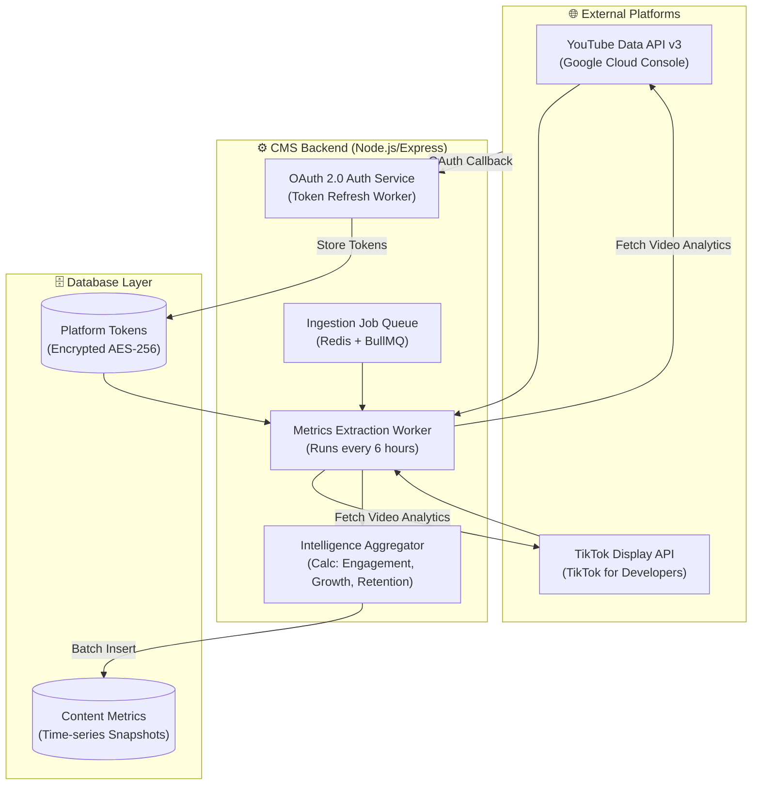

# 2. Content Intelligence & External API Specification (Year 4 Blueprint)

เอกสารนี้ระบุการออกแบบสถาปัตยกรรมระบบ **Content Intelligence** สำหรับการเชื่อมต่อแพลตฟอร์มภายนอก (YouTube และ TikTok) เพื่อดึงข้อมูลสถิติผลตอบรับ (Metrics Ingestion) และนำมาประมวลผลสำหรับโครงงานปี 4

---

## 🌐 1. สถาปัตยกรรมการเชื่อมต่อ (External Ingestion Architecture)



---

## 🔑 2. ข้อกำหนดการยืนยันตัวตน (OAuth 2.0 & Token Lifecycle)

### YouTube (Google API)
- **Scope**: `https://www.googleapis.com/auth/youtube.readonly`, `https://www.googleapis.com/auth/yt-analytics.readonly`
- **Token Flow**:
  1. Manager กดปุ่ม "เชื่อมต่อช่อง YouTube"
  2. ระบบ Redirect ไปยังหน้า Google Consent Screen
  3. Google ส่งคืน Authorization Code $\rightarrow$ Backend แลกเป็น `access_token` (อายุ 1 ชั่วโมง) และ `refresh_token` (ถาวร)
  4. จัดเก็บ `refresh_token` โดยเข้ารหัสผ่าน **AES-256-GCM**

### TikTok (TikTok for Developers)
- **Scope**: `user.info.basic`, `video.list`, `video.insights`
- **Token Flow**:
  1. Authorize ผ่าน TikTok Login Kit
  2. แลกรับ `access_token` (อายุ 24 ชั่วโมง) และ `refresh_token` (อายุ 365 วัน)

---

## ⏱️ 3. การดึงข้อมูลอัตโนมัติ (Automated Ingestion Worker)

ระบบจะใช้ Background Worker (BullMQ หรือ Cron Scheduler) ทำงานทุกๆ 6 ชั่วโมง:
```javascript
// ตัวอย่างตรรกะ Ingestion Worker สำหรับปี 4
async function ingestPlatformMetrics(contentId, platformVideoId, platform) {
  const token = await getDecryptedToken(platform);
  let rawStats;

  if (platform === 'YouTube') {
    rawStats = await youtubeApi.videos.list({
      part: ['statistics', 'contentDetails'],
      id: [platformVideoId],
      headers: { Authorization: `Bearer ${token}` }
    });
  } else if (platform === 'TikTok') {
    rawStats = await tiktokApi.getVideoInsights(platformVideoId, token);
  }

  // คำนวณสูตร Engagement Rate ตามมาตรฐานวิชาการ
  // Engagement = (Likes + Comments + Shares) / Views * 100
  const views = Number(rawStats.views) || 0;
  const interactions = (Number(rawStats.likes) || 0) + 
                       (Number(rawStats.comments) || 0) + 
                       (Number(rawStats.shares) || 0);
  const engagementRate = views > 0 ? (interactions / views) * 100 : 0;

  // บันทึก Snapshot ลงในตาราง content_metrics
  await saveMetricSnapshot({
    contentId,
    platform,
    views,
    likes: rawStats.likes,
    comments: rawStats.comments,
    shares: rawStats.shares,
    engagementRate: Number(engagementRate.toFixed(2)),
    collectedAt: new Date(),
  });
}
```

