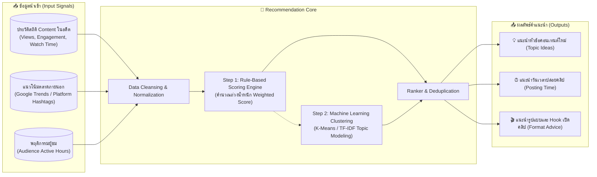

# 3. Recommendation Engine Architecture (Year 4 Blueprint)

เอกสารนี้ระบุการออกแบบสถาปัตยกรรมระบบ **Recommendation Engine (ระบบให้คำแนะนำการผลิตสื่ออัจฉริยะ)** ซึ่งแบ่งกระบวนการพัฒนาออกเป็น 2 ระยะ: จาก **Rule-Based Heuristic (ระยะเริ่มต้นปี 4)** สู่ **Machine Learning Model (ระยะสมบูรณ์ของปริญญานิพนธ์)**

---

## 🎯 1. พันธกิจของระบบแนะนำ (Recommendation Goals)

ระบบแนะนำไม่ได้คิดคอนเทนต์ขึ้นมาเองแบบมั่วๆ แต่ทำหน้าที่วิเคราะห์ข้อมูลในอดีต (Historical Performance) ร่วมกับข้อมูลแนวโน้ม (Trend Signals) เพื่อตอบคำถาม 4 ประการแก่ Content Lead / Manager:
1. **What to Produce (หัวข้ออะไร)**: แนะนำหมวดหมู่และคีย์เวิร์ดที่กำลังเติบโต (High Growth Topic)
2. **When to Post (โพสต์เวลาใด)**: คำนวณช่วงเวลาที่มีการมีส่วนร่วมสูงสุด (Optimal Posting Time Window)
3. **Which Format (รูปแบบใด)**: แนะนำความยาวคลิป (เช่น 45 วินาที สำหรับ TikTok, 8-10 นาที สำหรับ YouTube)
4. **Where to Distribute (ลงช่องทางใด)**: วิเคราะห์ว่าเนื้อหาประเภทนี้เหมาะกับ YouTube, TikTok หรือ Instagram

---

## ⚙️ 2. สถาปัตยกรรมระบบแนะนำ (Recommendation Pipeline)

---

## 🧮 3. อัลกอริทึมระยะที่ 1: Rule-Based Scoring Model (แนะนำสำหรับการเริ่มปี 4)

ในเทอมแรกของปี 4 สามารถใช้อัลกอริทึมเชิงตัวเลขถ่วงน้ำหนัก (Weighted Heuristics) ที่อธิบายต่อคณะกรรมการได้ง่ายและมีความโปร่งใสสูง (Explainable AI):

$$\text{Recommendation Score} = w_1 \cdot \text{Normalized Engagement} + w_2 \cdot \text{Growth Velocity} + w_3 \cdot \text{Category Retention}$$

โดยกำหนดค่าน้ำหนัก:
- $w_1 = 0.45$ (อัตราการมีส่วนร่วมของคลิปแนวเดียวกันใน 30 วันล่าสุด)
- $w_2 = 0.35$ (อัตราการเติบโตของยอดค้นหาคีย์เวิร์ดบนแพลตฟอร์ม)
- $w_3 = 0.20$ (ความต่อเนื่องของระยะเวลาการรับชมเฉลี่ย Average View Duration)

---

## 🤖 4. อัลกอริทึมระยะที่ 2: Machine Learning Evolution (เทอมสองของปี 4)

1. **Topic Clustering (K-Means & Sentence-BERT)**:
   - นำชื่อคลิปและแฮชแท็กที่ทำยอดวิวเกิน 100K มาแปลงเป็น Text Embeddings
   - จัดกลุ่ม Cluster เพื่อหา "Blue Ocean Topics" (หัวข้อที่มีคนดูเยอะแต่คู่แข่งในตลาดยังทำน้อย)
2. **Posting Time Regression**:
   - นำ `publishedAt` และ `views_first_24h` เข้าโมเดล Regression เพื่อทำนาย Heatmap แสดงช่วงเวลาที่ดีที่สุดในแต่ละวันของสัปดาห์ (เช่น วันพฤหัสบดี 19:30 น. สำหรับคลิปสั้นไอที)

