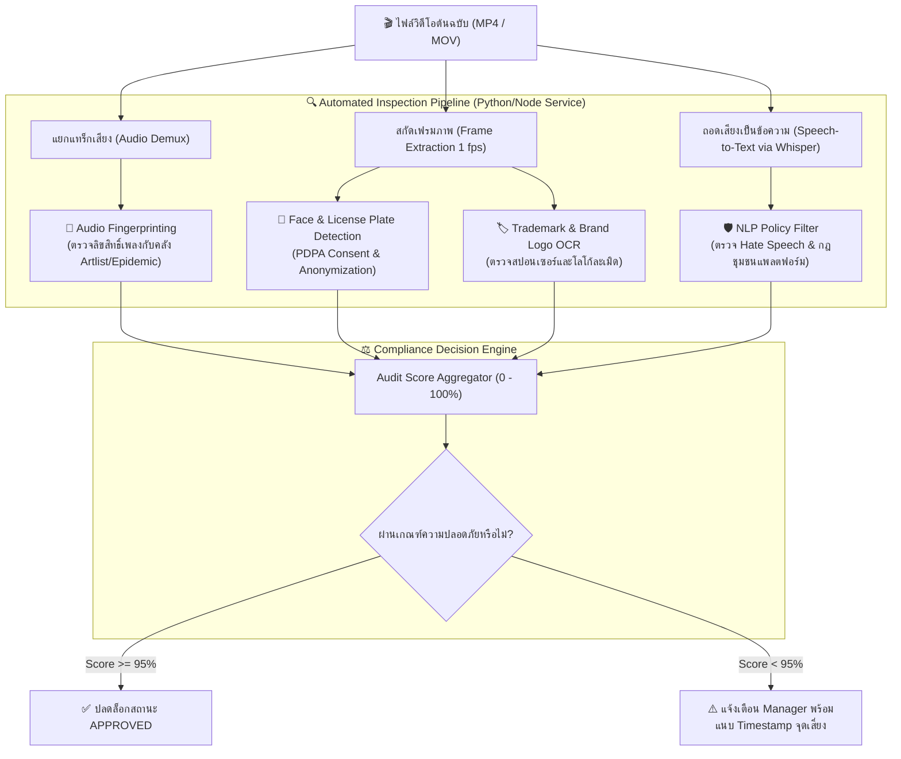

# 4. Automated Legal & AI Compliance Specification (Year 4 Blueprint)

เอกสารนี้ระบุการต่อยอดระบบ **Legal & Compliance Gatekeeper** จากระบบตรวจสอบด้วยตนเอง (Manual 5-Pillar Checklist ในปัจจุบัน) สู่ระบบ **AI-Assisted Automated Audit** สำหรับโครงงานปี 4

---

## ⚖️ 1. สถาปัตยกรรมระบบตรวจข้อกำหนดกฎหมายอัตโนมัติ (Automated Compliance Architecture)

---

## 🛠️ 2. เทคโนโลยีที่ใช้ในการตรวจสอบแต่ละเสาหลัก (Tech Stack by Pillar)

### เสาหลักที่ 1: ตรวจจับลิขสิทธิ์เพลง (Music Copyright)
- **เทคโนโลยี**: Audio Fingerprinting (Chromaprint / AcoustID หรือ ACRCloud SDK)
- **การทำงาน**: สกัด Spectral Peak ของเพลงประกอบในคลิป แล้วนำไปเทียบกับฐานข้อมูลเพลงเชิงพาณิชย์ที่สตูดิโอซื้อสิทธิ์ไว้ หากพบเพลงที่มีลิขสิทธิ์และไม่มี License Key จะแจ้งเตือนทันที

### เสาหลักที่ 2: คุ้มครองข้อมูลส่วนบุคคลและใบหน้า (PDPA Compliance)
- **เทคโนโลยี**: Computer Vision (MediaPipe Face Detection / OpenCV)
- **การทำงาน**: สแกนใบหน้าบุคคลในคลิป ตรวจสอบว่ามีใบหน้าที่ไม่อยู่ในฐานข้อมูลทีมงาน (Talent Release Form) หรือไม่ พร้อมระบบ Auto-Blur อัตโนมัติ

### เสาหลักที่ 3: ตรวจสอบเครื่องหมายการค้าและสปอนเซอร์ (Trademark Disclosure)
- **เทคโนโลยี**: Object Detection (YOLOv8) + EasyOCR
- **การทำงาน**: ตรวจหาโลโก้แบรนด์สินค้าที่อาจละเมิดลิขสิทธิ์ และตรวจสอบว่าคลิปที่มีสปอนเซอร์มีการแสดงคำเตือน `#PaidPartnership` หรือ `#โฆษณา` ถูกต้องตามกฎหมาย สคบ. หรือไม่

### เสาหลักที่ 4: ตรวจสอบนโยบายชุมชนและความปลอดภัย (Community Standards)
- **เทคโนโลยี**: OpenAI Whisper (Audio to Text) + RoBERTa Toxic Comment Classifier
- **การทำงาน**: ถอดเสียงพูดในคลิปเป็น Text แล้วตรวจจับคำหยาบคาย, ข้อมูลหลอกลวง (Misinformation), หรือ Hate Speech

