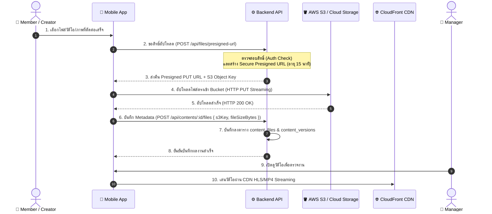

# 5. Cloud Object Storage & Asset Pipeline Specification (Year 4 Blueprint)

เอกสารนี้ระบุการออกแบบสถาปัตยกรรมการจัดเก็บไฟล์มีเดียขนาดใหญ่ (Large Media Assets) เพื่อยกระดับจากการแนบลิงก์ Google Drive สู่การใช้งาน **Cloud Object Storage (AWS S3 / Google Cloud Storage / Cloudflare R2)** พร้อม **Presigned Upload URLs** สำหรับโปรเจกต์ปี 4

---

## ☁️ 1. สถาปัตยกรรม Direct-to-Cloud Upload (ป้องกัน Server ล่ม)

> [!WARNING]
> **ทำไมห้ามอัปโหลดไฟล์วิดีโอผ่าน Express Server ตรงๆ?**  
> ไฟล์วิดีโอ 4K/1080p มีขนาด 200MB - 2GB หากให้ Mobile App ส่งไฟล์ผ่าน Express Server จะทำให้ Node.js Event Loop บล็อกตัว, Memory พุ่งสูง และเซิร์ฟเวอร์จะปฏิเสธคำขออื่นทันที

### ทางออกระดับสากล: Presigned URL Pattern


---

## 🗂️ 2. โครงสร้างการจัดเก็บใน Bucket (S3 Object Hierarchy)

จัดระเบียบตาม Content ID และ Version อย่างเป็นระบบ:
```text
production-media-bucket/
└── contents/
    └── {content_id}/
        ├── raw/                  <-- ฟุตเทจดิบและไฟล์ต้นฉบับ
        │   └── camera_a_take1.mov
        ├── versions/             <-- ไฟล์วิดีโอที่ตัดต่อส่งตรวจแต่ละรอบ
        │   ├── v1_draft.mp4
        │   └── v2_revised.mp4
        ├── thumbnails/           <-- รูปภาพหน้าปก
        │   ├── cover_final.png
        │   └── cover_thumbnail_sm.webp
        └── legal_proofs/         <-- เอกสารใบอนุญาตและ PDPA Consent
            ├── music_license_artlist.pdf
            └── talent_consent_form.pdf
```

